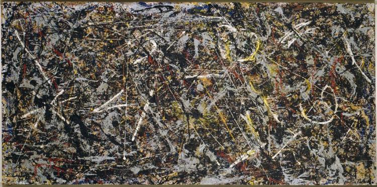

## 基本信息

- 作者：[[波洛克 Jackson Pollock]]
- 创作年代：1947
- 材质：油画、铝漆、油画颜料、绳、画布等综合材料 (*not from wiki*)
- 尺寸：(*not from wiki*)
- 现存地：威尼斯佩姬·古根海姆美术馆 Peggy Guggenheim Collection, Venice (*not from wiki*)

## 画面与技法

[[滴画法 Drip Painting]] 觉醒后的首批代表作之一。波洛克把大画布铺地，用颜料罐倾倒、甩动，把烟头、钮扣、钥匙都掉在画布上——延续了 [[拼贴 Collage]] 概念。**画面效果与以往大不相同**。

工艺源头三股汇流：[[西盖罗斯 David Alfaro Siqueiros]] 喷壶 + [[恩斯特 Max Ernst]] 颜料罐打洞甩颜料 + [[超现实主义 Surrealism]] [[自动写作 Automatic Writing|自动书写]]。

## 历史背景 (*not from wiki*)

1947 年波洛克离开纽约市搬到长岛斯普林斯 (Springs)，得到一个更大的工作室——这是滴画法诞生的物理空间前提。后由佩姬·古根海姆带回威尼斯，成为她个人收藏的核心藏品之一。

## 图片清单

| 编号 | 出自 | 描述 |
|---|---|---|
| 01 | [[096｜波洛克：什么是当代艺术的第一个流派？]] | 炼金术 Alchemy (1947) |

## 出现在

- [[096｜波洛克：什么是当代艺术的第一个流派？]]
