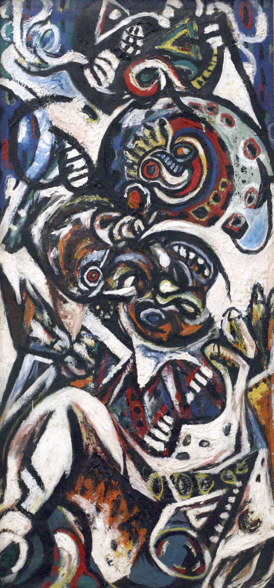

## 基本信息

- 作者：[[波洛克 Jackson Pollock]]
- 创作年代：1945
- 材质：(*not from wiki*)
- 尺寸：(*not from wiki*)
- 现存地：(*not from wiki*)

## 画面与技法

明显具有**自动创作**特点的作品——顾衡说"波洛克可终于找到拿手的了，因为他总是处于醉醺醺不清醒的状态"。是从梦境绘画向滴画法过渡的中段产物。

## 历史背景 (*not from wiki*)

1945 年波洛克与 [[克拉斯纳 Lee Krasner]] 结婚。距 [[滴画法 Drip Painting]] 觉醒还有两年。

## 图片清单

| 编号 | 出自 | 描述 |
|---|---|---|
| 01 | [[096｜波洛克：什么是当代艺术的第一个流派？]] | 烦恼的皇后 Troubled Queen (1945) |

## 出现在

- [[096｜波洛克：什么是当代艺术的第一个流派？]]
