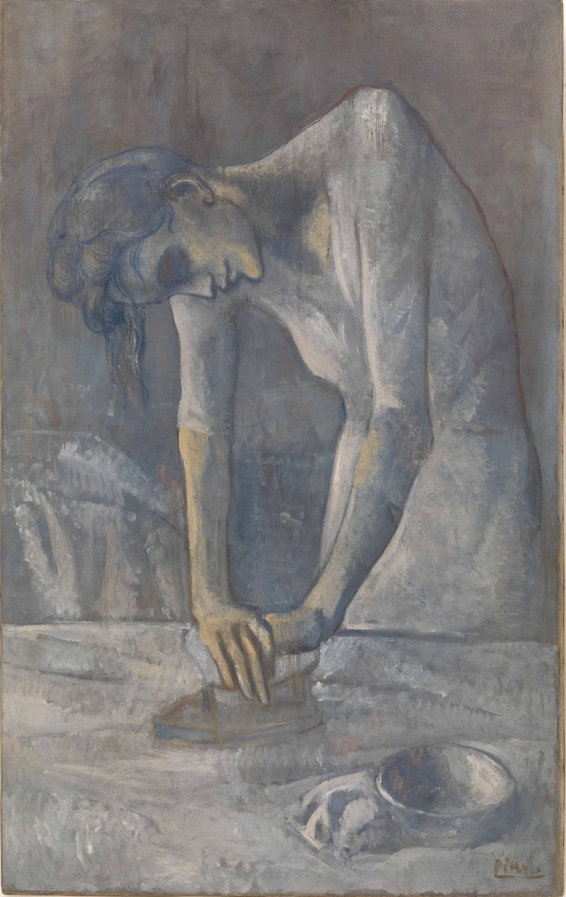

## 基本信息

- 作者：[[毕加索 Pablo Picasso]]
- 创作年代：1904
- 材质：布面油画 (*not from wiki*)
- 尺寸：116.2 × 73 cm (*not from wiki*)
- 现存地：纽约古根海姆博物馆 (Solomon R. Guggenheim Museum) (*not from wiki*)

## 画面与技法

[[蓝色时期 Blue Period]] 定型阶段的"强烈同质性"样本——一名瘦削的洗衣女工弯腰使力按熨斗，肩胛骨与肋骨突出、四肢拉长，是 [[埃尔·格列柯 El Greco]] 式 [[矫饰主义 Mannerism]] 的典型应用。背景被 [[夏凡纳 Pierre Puvis de Chavannes]] 式简化删除到几乎只剩光影。

题材延续 [[现实主义 Realism]] 以来对"劳动妇女"的关注（[[德加 Edgar Degas]] 也有同题材作品），但毕加索剥离了所有社会环境，把题材推向象征性而非纪实性。 (*not from wiki*)

## 历史背景 (*not from wiki*)

- 创作于 1904 年——这一年毕加索正式定居巴黎 Bateau-Lavoir 工作室、年底结识 [[费尔南德 Fernande Olivier]]。
- 是蓝色时期向 [[玫瑰红时期 Rose Period]] 过渡前的代表作。

## 图片清单

| 编号 | 出自 | 描述 |
|---|---|---|
| 01 | [[064｜毕加索1：如何理解"蓝色时期"和"玫瑰红时期"？]] | 整幅画面 |

## 出现在

- [[064｜毕加索1：如何理解"蓝色时期"和"玫瑰红时期"？]]
