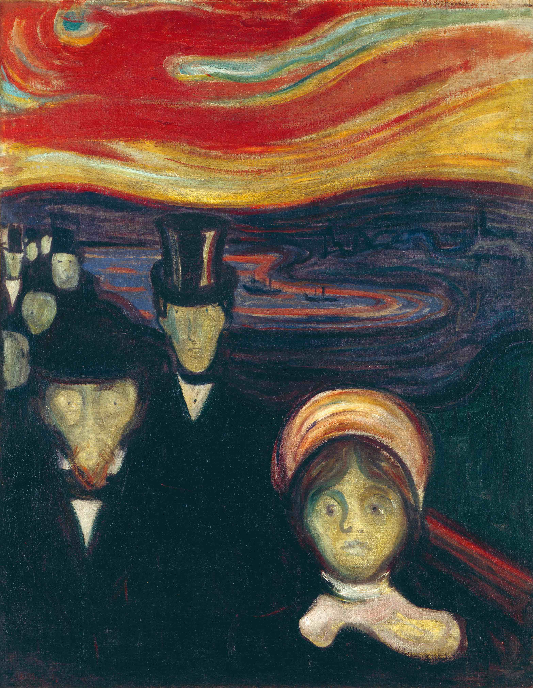

## 基本信息

- 作者：[[爱德华·蒙克 Edvard Munch]]
- 创作年代：1894
- 材质：布面油画 (*not from wiki*)
- 尺寸：未注明
- 现存地：奥斯陆 蒙克美术馆 (*not from wiki*)

## 画面与技法

[[爱组画 The Frieze of Life]] 六联画之一，与 [[呐喊 The Scream]]、[[绝望 Despair]]、[[嫉妒 Jealousy]] **表现出很高的同质性**——反映的是 **蒙克要把人类情感全部符号化、公式化的努力**（顾衡 070）。

构图复用 [[呐喊 The Scream]] 的**斜向栏杆 + 血色天空**主程式，只是把单一无声呐喊的主体替换为**一群面无表情、骷髅般凝视前方的市民**——焦虑由"个人感觉"被翻译为"集体面具"。

## 历史背景 (*not from wiki*)

顾衡 070 提示：本作虽常被归为"表现主义"代表作之一，但严格而言仍属蒙克的**象征主义时期**——表现主义阶段要到 070 之后的 [[爱德华·蒙克 Edvard Munch]] 创作才正式开启（071 蒙克 2 续讲）。

## 图片清单

| 编号 | 出自 | 描述 |
|---|---|---|
| 01 | [[070｜蒙克1：表现主义的先行者经历了什么？]] | 一群面无表情的人 + 斜向栏杆 + 血色云 |

## 出现在

- [[070｜蒙克1：表现主义的先行者经历了什么？]]
