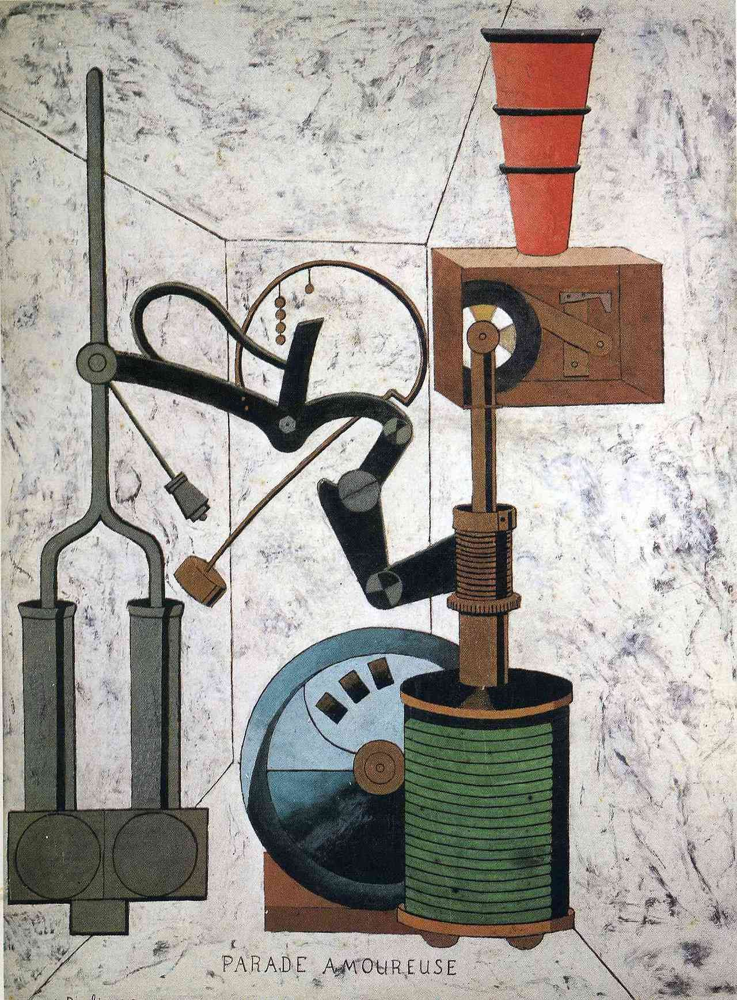

## 基本信息

- 作者：[[毕卡比亚 Francis Picabia]]
- 创作年代：1917
- 材质：布面油画 (*not from wiki*)
- 尺寸：约 96 × 73 cm (*not from wiki*)
- 现存地：私人收藏 (*not from wiki*)

## 画面与技法

[[毕卡比亚 Francis Picabia]] **达达"机器画女人"期**作品——一组机器构件互相咬合 / 抚摸 / 摩擦，标题"爱的游行"将之拟人化为情爱场景。

## 历史背景

(*not from wiki*) 1917 年同年，[[杜尚 Marcel Duchamp]] 把小便器《[[泉 (杜尚) Fountain (Duchamp)]]》送进独立画展——纽约达达的"装置 / 现成品 vs 绘画"双轨在这一年并行运行。

## 图片清单

| 编号 | 出自 | 描述 |
|---|---|---|
| 01 | [[091｜毕卡比亚：如何用绘画表现达达主义？]] | 整体图 — 机器构件的"情爱游行" |

## 出现在

- [[091｜毕卡比亚：如何用绘画表现达达主义？]]
