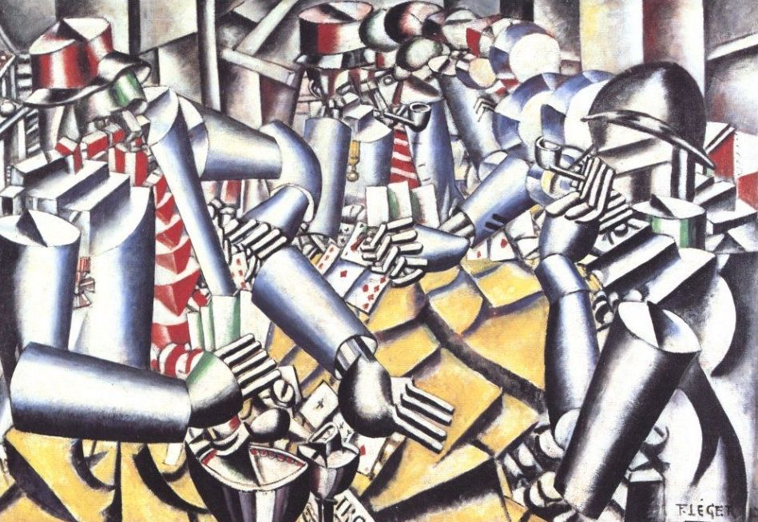

## 基本信息

- 作者：[[莱热 Fernand Léger]]
- 创作年代：1917
- 材质：布面油画 (*not from wiki*)
- 尺寸：129.5 × 193 cm (*not from wiki*)
- 现存地：克勒勒-米勒博物馆 (Kröller-Müller Museum, 荷兰奥特洛) (*not from wiki*)

## 画面与技法

莱热一战服役期间创作的代表作。三个士兵在战壕休整时打牌，**头、手、躯干、军装、烟斗、纸牌全部分解为闪亮金属感的圆柱体**——像三具机器人在博弈，已经预示了二十世纪机器人 / 机械美学的视觉源头。

顾衡评："反映战壕生活"——但**人物毫无血肉感**，只有金属感的几何造型。

## 历史背景 (*not from wiki*)

被广泛视为**莱热一生最重要的作品之一**，也是 20 世纪机械化、工业化美学进入现代绘画的早期标志作。常作为"立体主义 + 现代工业意象"的范本被研究。

## 图片清单

| 编号 | 出自 | 描述 |
|---|---|---|
| 01 | [[068｜立体主义，除了毕加索还值得了解什么？]] | 战壕中打牌的"机器人士兵" |

## 出现在

- [[068｜立体主义，除了毕加索还值得了解什么？]] —— "管子主义"高峰，机器人美学源头
