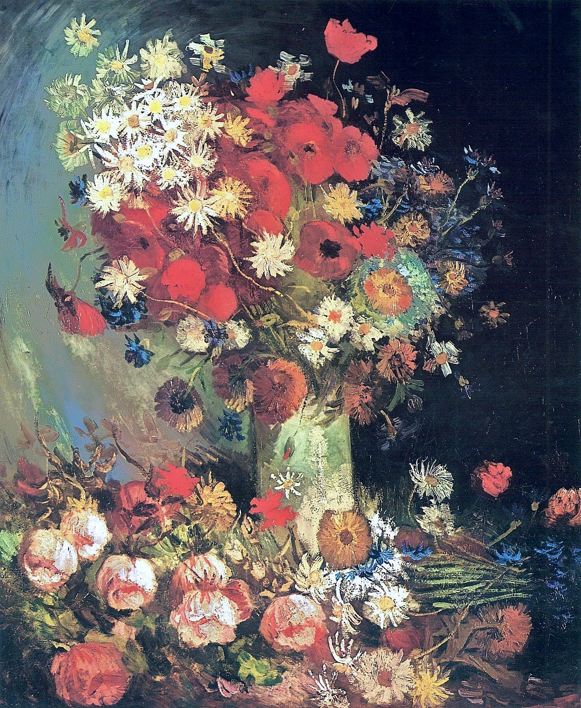

## 基本信息

- 作者：[[凡·高 Vincent van Gogh]]
- 创作年代：1886
- 材质：布面油画 (*not from wiki*)
- 尺寸：(*not from wiki*) 99 × 79 cm
- 现存地：(*not from wiki*) 华盛顿巴恩斯基金会 (Barnes Foundation)

## 画面与技法

凡·高 1886 年抵达巴黎后不久所作的静物，色彩开始变亮，但仍延续他在荷兰时期的厚画法。有人批评"没什么立体感"——凡·高的回应被 058 引为他艺术观的样板：

> 你以为我不关心技巧吗？我当然关心！但是我关心的目的，只是为了用技巧去表现我能够和我必须说的那种东西。至于我的艺术语言是否合乎艺术评论家和观众的胃口，我根本就不在乎。

顾衡 058 在此回到 057 的福音派学校轶事——老师问"主格还是宾格"，凡·高回答"我根本就不在乎"——**偏执、文饰、以"不为"掩饰"不能"**的同一性格在此处对外亮相。

## 历史背景 (*not from wiki*)

凡·高 1886 年 3 月抵达巴黎与弟弟 [[提奥 Theo van Gogh]] 同住，到夏秋之间集中创作了一批花卉静物——这是他从荷兰暗调向巴黎亮调过渡的关键时期。后人将这一系列视为印象派色彩理论在他笔下"被消化"的第一批样本。

## 图片清单

| 编号 | 出自 | 描述 |
|---|---|---|
| 01 | [[058｜凡·高2：为什么他的风格难以界定？]] | 整幅画作，1886 巴黎初期静物 |

## 出现在

- [[058｜凡·高2：为什么他的风格难以界定？]]
