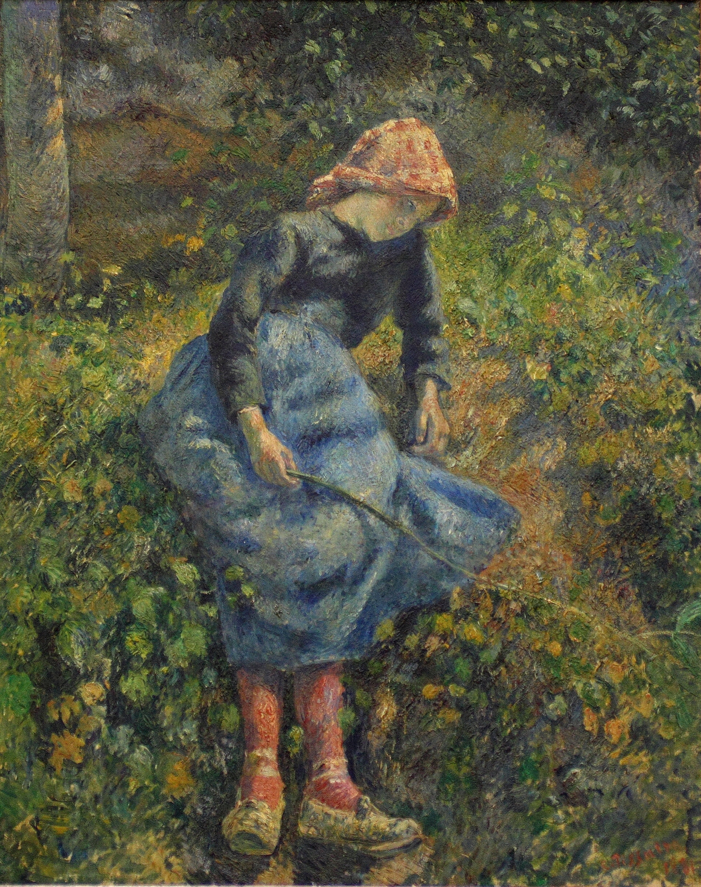

## 基本信息

- 作者：[[毕沙罗 Camille Pissarro]]
- 创作年代：1881
- 材质：布面油画 (*not from wiki*)
- 尺寸：(*not from wiki*) 81 × 64.7 cm
- 现存地：(*not from wiki*) 巴黎奥赛博物馆 (Musée d'Orsay)

## 画面与技法

少女坐于田野草地上，手持一根细棍——身后是青翠草丛。**整幅画由颜色不同的细碎小色块一笔一笔拼出来**——光线从树叶间漏下，绿色草地里夹杂黄、紫、橘色斑点——是顾衡 040 用来对照 [[大宫女 The Grand Odalisque]] **"平滑连续"画面**的**马赛克式画法**典型样本：
- 户外创作
- **不画素描**
- 忠实呈现眼睛所见
- **细碎小色块**取代层层薄涂罩染

## 历史背景 (*not from wiki*)

毕沙罗在 1880 年代搬到 Éragny-sur-Epte 乡村定居，画了大量农民少女题材。本作完成于他与塞尚密切交流期；同时期也开始尝试新印象派的点彩技法萌芽。

## 在课程中的角色

顾衡 040 把它与 [[大宫女 The Grand Odalisque]] 并置作为**印象派 vs 学院派的代表对照**——"学院派绘画与印象派绘画在几乎所有方面都是相反的"五条对照表的演示画。

## 图片清单

| 编号 | 出自 | 描述 |
|---|---|---|
| 01 | [[040｜什么是印象派?]] | 全画 |

## 出现在

- [[040｜什么是印象派?]] —— 印象派代表样本，与《大宫女》对照
- [[毕沙罗 Camille Pissarro]] —— 代表作
- [[印象派 Impressionism]] —— 流派演示样本
