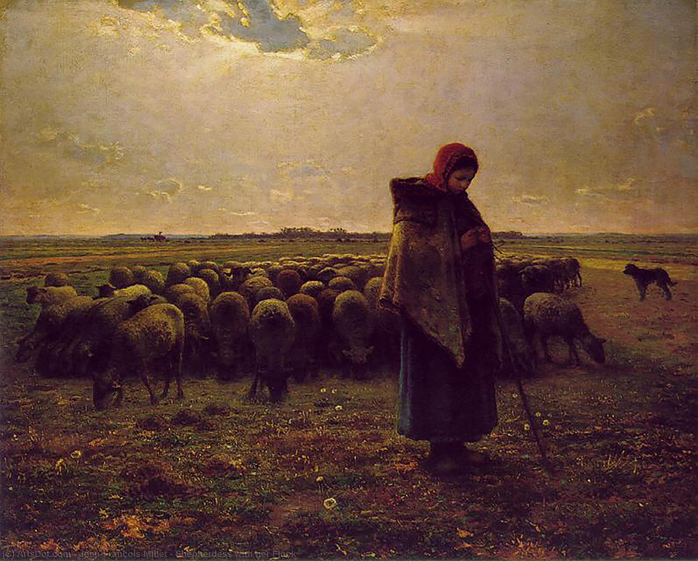

## 基本信息

- **作者**：[[米勒 Jean-François Millet]]
- **创作年代**：1864
- **材质**：油画，布面 (*not from wiki*)
- **尺寸**：81 × 101 cm (*not from wiki*)
- **现存地**：法国巴黎奥赛博物馆 (*not from wiki*)

## 画面与技法

(*not from wiki*) 牧羊女背对画面、披深色斗篷、手执纺锤低头编织——身后散布着她的羊群，远景空旷的法国乡村。**人物高出地平线**呈纪念碑式剪影——与《拾穗者》《晚钟》同构。米勒用**暖色暮光**和**羊群形成的水平节奏**渲染牧歌氛围；颜色和明暗过渡极柔和。

## 历史背景 (*not from wiki*)

1864 年沙龙首展即引起轰动；获大金奖。本画与《晚钟》《拾穗者》共同构成米勒"农民牧歌"三联——是 1867 年世博会专室让米勒大放异彩的代表作之一。

## 在课程中的角色

顾衡 036 末段把本画与《晚钟》《拾穗者》《扶锄男子》《播种者》《去劳动》一起列出——指出**这些作品里有一个共同的内核，就像一首奏鸣曲的主题，在不断地重复和再现**：诗意 + 对农民苦难的深切同情。

## 图片清单

| 编号 | 出自 | 描述 |
|---|---|---|
| 01 | [[036｜米勒：什么是"伟大的现实主义"？]] | 全画 |

## 出现在

- [[036｜米勒：什么是"伟大的现实主义"？]] —— "米勒主题母题"组画之一
- [[米勒 Jean-François Millet]] —— 代表作
- [[现实主义 Realism]] —— 农民牧歌母题
