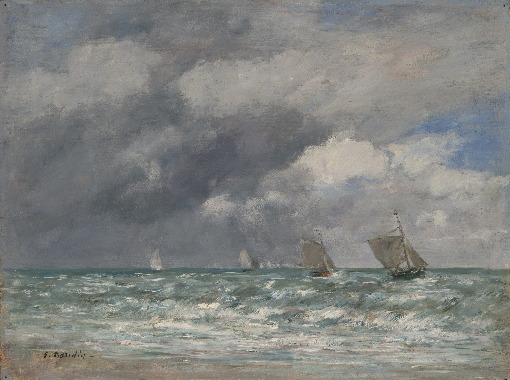

## 基本信息

- 作者：[[布丹 Eugène Boudin]]
- 创作年代：1884（041 caption）
- 材质：(*not from wiki*) 布面油画
- 尺寸：(*not from wiki*)
- 现存地：(*not from wiki*)

## 画面与技法

041 出现的布丹海景作品——典型布丹"画出眼睛即时看见的东西"诉求的实践，浅色海面与天空、轻盈帆船、留有鲜明笔触的写生式直接处理。

041 顾衡用此作具体说明"画出眼睛即时所见"为何**需要极端强调速度**——这条要求是莫奈后来全部画法的种子。

## 历史背景

(*not from wiki*) 特鲁维尔 Trouville-sur-Mer 是诺曼底海岸度假地，与勒阿弗尔接近。布丹长期在此一带写生海景。041 提及布丹是勒阿弗尔画框店老板，海景画"画得挺好"。

## 图片清单

| 编号 | 出自 | 描述 |
|---|---|---|
| 01 | [[041｜莫奈1：颠覆式的创新从何而来？]] | 特鲁维尔海面帆船 |

## 出现在

- [[041｜莫奈1：颠覆式的创新从何而来？]]
