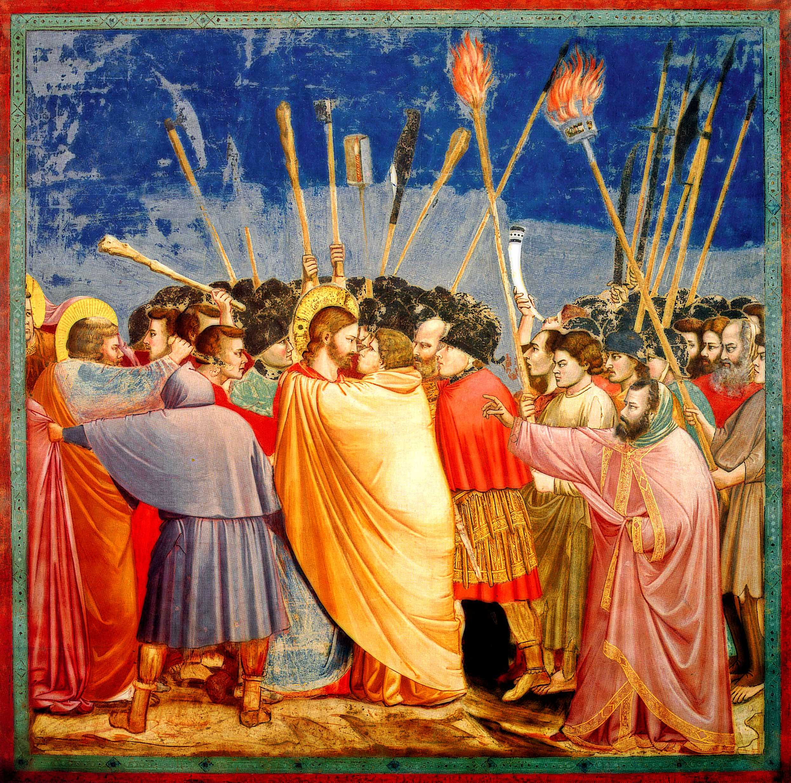

## 基本信息

- 作者：[[乔托 Giotto]]
- 创作年代：1304–1306
- 材质：湿壁画 (fresco) (*not from wiki*)
- 尺寸：约 200 × 185 cm (*not from wiki*)
- 现存地：意大利帕多瓦 · 斯克罗维尼礼拜堂 (Cappella degli Scrovegni, Padova) (*not from wiki*)

## 画面与技法

意大利文艺复兴前期 **蛋彩 / 湿壁画** 的代表作之一。画面以 **少量、清晰可读的造型元素** 表现福音书中的核心瞬间——犹大以一吻出卖基督。顾衡在 [[049｜夏凡纳：如何制作象征主义的密电码？]] 中指出，**[[夏凡纳 Pierre Puvis de Chavannes]] 真正倾心的就是 [[乔托 Giotto]] / [[杜乔 Duccio]] 这一路 "返璞归真" 的蛋彩壁画**——画面元素的简化、人物造型的程式化，正是 19 世纪 [[象征主义 Symbolism]] **"密电码式造型"** 的远端源头。

## 历史背景 (*not from wiki*)

为帕多瓦银行家恩里科·斯克罗维尼 (Enrico Scrovegni) 私人礼拜堂作的基督生平系列壁画之一。整组壁画通常被视为 **西方绘画走向自然主义、戏剧性张力的转折点**，[[乔托 Giotto]] 由此被瓦萨里追认为 "复兴绘画的第一人"。

## 图片清单

| 编号 | 出自 | 描述 |
|---|---|---|
| 01 | [[049｜夏凡纳：如何制作象征主义的密电码？]] | 整幅画面 |

## 出现在

- [[049｜夏凡纳：如何制作象征主义的密电码？]] —— 作为 [[夏凡纳 Pierre Puvis de Chavannes]] 真正师承的样本被引用
