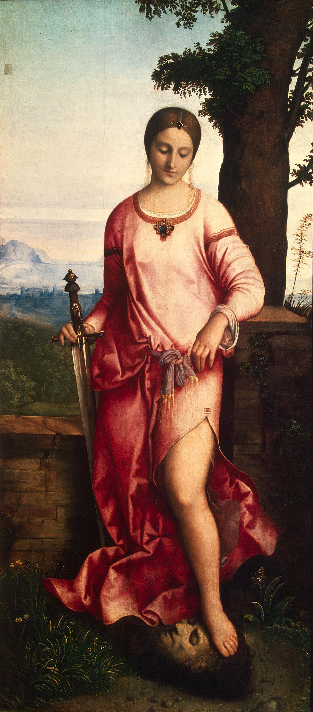

## 基本信息

- 作者：[[乔尔乔内 Giorgione]] (归属有争议)
- 创作年代：约 1504–1510 (顾衡引"1510") (*not from wiki*)
- 材质：布面油画
- 尺寸：144 × 66.5 cm (狭长构图) (*not from wiki*)
- 现存地：圣彼得堡冬宫博物馆 (Hermitage Museum, Saint Petersburg) (*not from wiki*)

## 画面与技法

犹太寡妇 **犹滴 (Judith)** 站在草地上，**左手提着将军 荷罗孚尼 的头颅**，右手持剑，左腿**裸露**——裙裾被她提起。脚下的荷罗孚尼的头颅就在草地上，被她**踩着**。

**叙事**：亚述大军包围伯修利亚，犹滴自愿前往敌营色诱将军荷罗孚尼，将军醉后她砍下他的头颅，为城市解围（旧约《犹滴传》）。

**与 [[犹滴归来 (波蒂切利) The Return of Judith]] (1472) 的对比** —— 顾衡 015 重点：

- **波蒂切利的犹滴**：提着刀的女英雄，大义凛然一身正气 —— "**生怕观众产生什么不好的联想**" (毕竟女色诱杀男的故事在道德上有歧义)
- **乔尔乔内的犹滴**：提着裙子，**让裸露的左腿成为整个画面的视觉焦点** —— 这正是威尼斯派"肉美"的姿态

形式上：乔尔乔内的色彩派操作——身体的丰盈、布料的质感、皮肤的光泽，全部由色调明暗塑造，没有锐利轮廓线。

## 历史背景

(*not from wiki*) 长期被归于多位作者；现学界主流认为是乔尔乔内的真迹或工坊作品。1772 年由叶卡捷琳娜大帝从克罗扎收藏 (Crozat Collection) 购入俄罗斯。

## 图片清单

| 编号 | 出自 | 描述 |
|---|---|---|
| 01 | [[015｜乔尔乔内：威尼斯画派创新在何处？]] | 整体图 |

## 出现在

- [[015｜乔尔乔内：威尼斯画派创新在何处？]]
