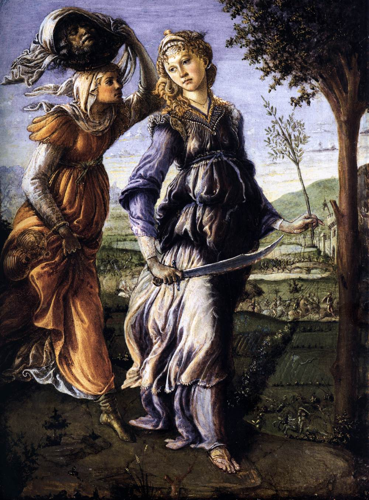

## 基本信息

- 作者：[[波蒂切利 Botticelli]]
- 创作年代：约 1470–1472 (顾衡引"1472") (*not from wiki*)
- 材质：木板蛋彩
- 尺寸：31 × 24 cm (小尺寸卧房画) (*not from wiki*)
- 现存地：佛罗伦萨乌菲齐美术馆 (Galleria degli Uffizi) (*not from wiki*)

## 画面与技法

犹滴 (Judith) 与女仆走回伯修利亚城——身后是和平的乡野；女仆**头顶上托着一个篮子，里面装着将军荷罗孚尼的头颅**；犹滴手持出鞘的剑、橄榄枝 (和平的象征)，**面容平静**，步伐轻盈。

**与 [[犹滴 (乔尔乔内) Judith]] (1510) 的对比** —— 顾衡 015 重点：

- **波蒂切利把犹滴画成"女英雄"**：大义凛然、一身正气；剑+橄榄枝把焦点放在解放城市的胜利上而非色诱的过程上 —— **"生怕观众产生什么不好的联想"**
- 体现 [[佛罗伦萨画派 Florentine School]] / [[理念美 Idea of Beauty]] 的取向：净化故事的肉欲层面，提升为道德寓言

形式上：典型波蒂切利早期翁布里亚风格 (与师傅 [[利比修士 Filippo Lippi]] 的"冰美人"程式一脉相承)——清晰线条、温和色彩、远景层叠的乡村。

## 历史背景

(*not from wiki*) 波蒂切利早期作品（28 岁前后）。本作配对作品《荷罗孚尼之死》(*The Discovery of the Body of Holofernes*) 同藏乌菲齐。

## 图片清单

| 编号 | 出自 | 描述 |
|---|---|---|
| 01 | [[015｜乔尔乔内：威尼斯画派创新在何处？]] | 整体图 |

## 出现在

- [[015｜乔尔乔内：威尼斯画派创新在何处？]]
