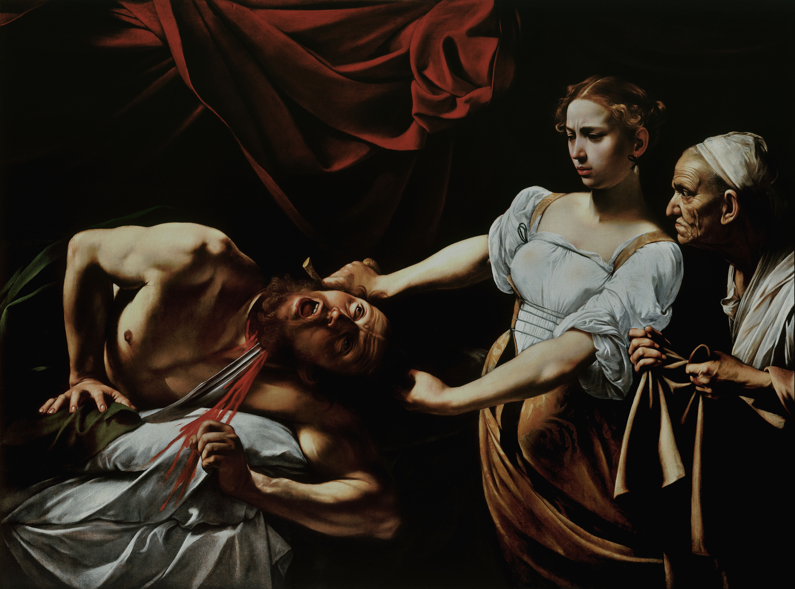

## 基本信息

- 作者：[[卡拉瓦乔 Caravaggio]]
- 创作年代：约 1599
- 材质：布面油彩 (*not from wiki*)
- 尺寸：145 × 195 cm (*not from wiki*)
- 现存地：罗马国家古代艺术美术馆 (Galleria Nazionale d'Arte Antica, Palazzo Barberini, Roma) (*not from wiki*)

## 画面与技法

旧约 **犹滴 (Judith)** 故事的高潮——犹滴乘亚述将领荷罗芬尼 (Holofernes) 醉睡时砍下其头颅。三人物：

- 左：荷罗芬尼仰躺、脖颈鲜血喷涌、面部痛苦扭曲；
- 中：年轻犹滴左手抓住其头发、右手挥刀深入颈部，眉头微蹙、表情冷峻但带犹豫；
- 右：年老女仆紧握一块白布，准备接首。

**[[酒窖光 Tenebrism]] 的标志性运用**：背景全黑、强光从画外左上方斜射而下，把三人物从虚无中凝定——血液 / 肉色 / 床单的红白对比被极端化。

**戏剧性的瞬间**：动作进行到一半（头颅刚被切下未脱离躯体）——非常典型的卡拉瓦乔 "凝定动作中点" 手法。

## 历史背景

(*not from wiki*) 银行家 Ottavio Costa 委托。是 [[酒窖光 Tenebrism]] 定型期的关键作品，被认为对后来 [[真蒂莱斯基 Artemisia Gentileschi]] 的同题作品（[[犹滴斩首荷罗芬尼 (真蒂莱斯基) Judith Beheading Holofernes (Gentileschi)]]）有 **决定性** 影响。

> ⚠️ 与既有 [[犹滴 (乔尔乔内) Judith]]（乔尔乔内，约 1504）虽同名"犹滴"，但表现的故事阶段完全不同——乔尔乔内画的是事后凯旋（脚踩头颅、姿态优雅），卡拉瓦乔画的是 **行凶现场**。

## 图片清单

| 编号 | 出自 | 描述 |
|---|---|---|
| 01 | [[023｜卡拉瓦乔：巴洛克的戏剧性从何而来？]] | 整体图 |

## 出现在

- [[023｜卡拉瓦乔：巴洛克的戏剧性从何而来？]]
