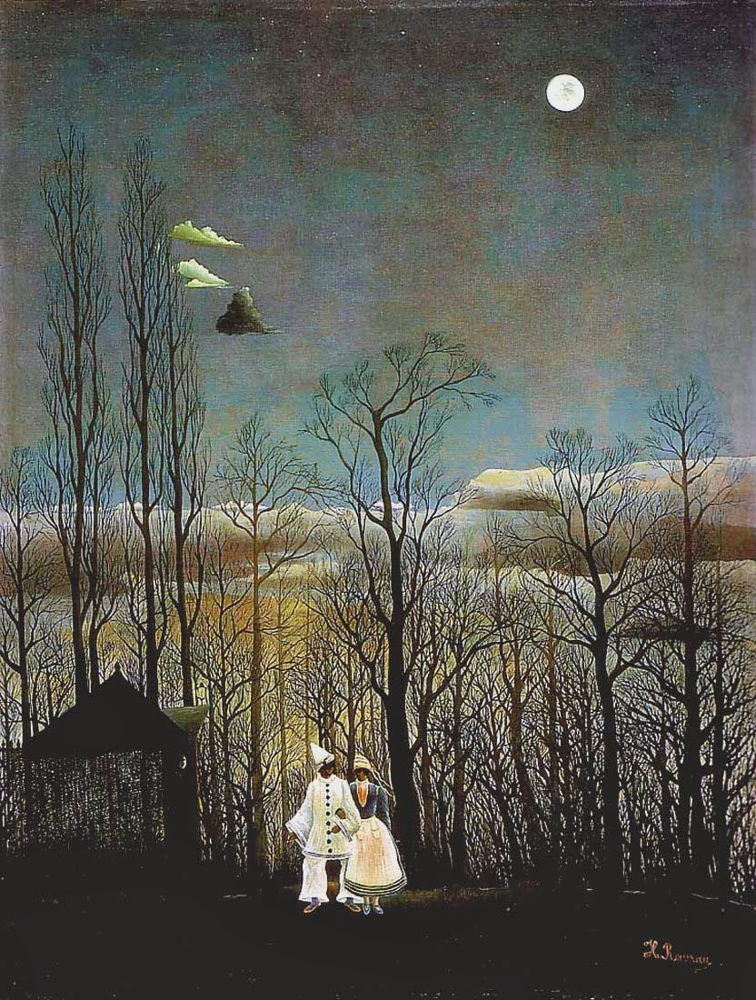

## 基本信息

- 作者：[[亨利·卢梭 Henri Rousseau]]
- 创作年代：1886
- 材质：布面油画 (*not from wiki*)
- 尺寸：117.3 × 89.5 cm (*not from wiki*)
- 现存地：费城艺术博物馆 / Philadelphia Museum of Art (*not from wiki*)

## 画面与技法

小两口参加完狂欢聚会之后，在凄清的月色中走在回家的路上。

被嘲笑的"哪儿哪儿都不对"：
- 房子与树林之间的位置关系不对
- 透视和比例不对
- 人物姿势不对
- **两口子的脚还不沾地**

顾衡 079："观众们纷纷表示，我家五岁的娃也能画这个。"

## 历史背景

1886 年是新印象主义画家 [[西涅克 Paul Signac]] 介绍卢梭加入"独立艺术家协会"的那一年。当年独立沙龙展无评审委员会，谁都能参加，这是卢梭第一次面向公众亮相的作品。

## 图片清单

| 编号 | 出自 | 描述 |
|---|---|---|
| 01 | [[079｜亨利·卢梭：毕加索对他的吹捧是真心的吗？]] | 全图：月夜小两口与树林房屋 |

## 出现在

- [[079｜亨利·卢梭：毕加索对他的吹捧是真心的吗？]]
