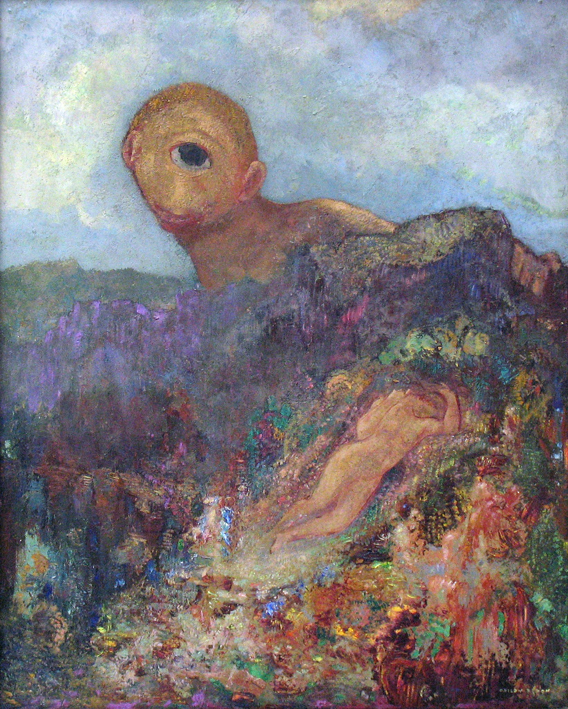

## 基本信息

- 作者：[[雷东 Odilon Redon]]
- 创作年代：1898（顾衡 051 注；学界另作 c. 1914，本 wiki 取顾衡值）
- 材质：板上油彩（*not from wiki*：Kröller-Müller 藏品记录为 oil on cardboard mounted on panel）
- 尺寸：年代不详
- 现存地：奥特洛 Kröller-Müller 博物馆（荷兰）(*not from wiki*)

## 画面与技法

雷东最著名的彩色幻想画之一。**独眼巨人 [波吕斐摩斯] 从山后冒出**，**俯视沉睡的伽拉忒亚**——色彩鲜艳，造型怪诞，独眼成为画面唯一的"心理焦点"。雷东用饱和色彩 + 模糊形状把希腊神话母题转换成 **梦境视觉**——顾衡 051 用作晚期雷东 "**鲜艳颜色 + 形状叙事弱化**" 路径的代表（→ [[大铁鸟 (货物崇拜) Cargo Cult]] 视觉变奏）。

## 历史背景 (*not from wiki*)

母题取自希腊神话：独眼巨人波吕斐摩斯爱慕海中宁芙伽拉忒亚 (Galatea)。雷东在 19 世纪末 20 世纪初多次重写该题，**也启发了 20 世纪超现实主义梦境绘画**（[[达利 Salvador Dalí]] 承认受过雷东影响）。

## 图片清单

| 编号 | 出自 | 描述 |
|---|---|---|
| 01 | [[051｜雷东：怪诞是不是象征主义的方向？]] | 独眼巨人俯视沉睡的伽拉忒亚 |

## 出现在

- [[051｜雷东：怪诞是不是象征主义的方向？]]
