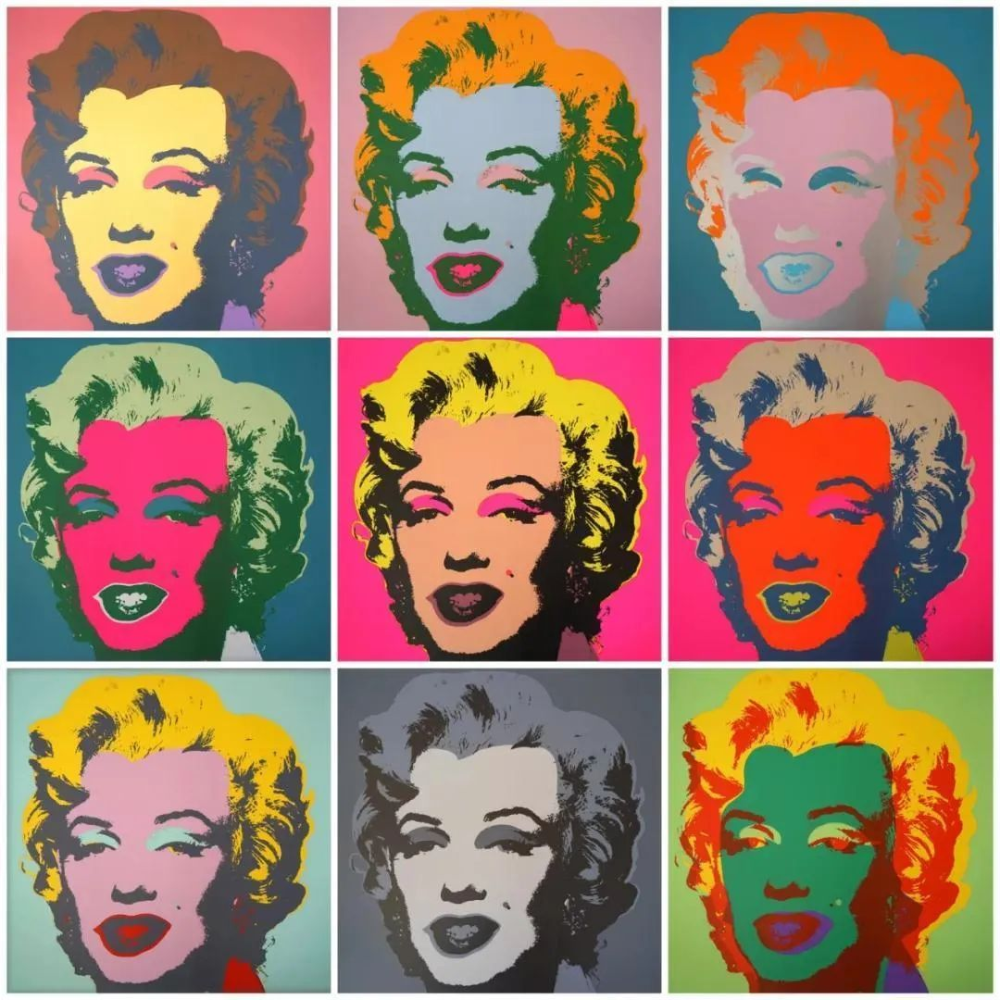

## 基本信息

- 作者：[[安迪·沃霍尔 Andy Warhol]]
- 创作年代：1962
- 材质：[[丝网印刷 Silkscreen]] 于画布
- 尺寸：（*not from wiki*）系列；著名《Marilyn Diptych》205.4 × 289.6 cm
- 现存地：（*not from wiki*）泰特美术馆 Tate（《Diptych》）等多家机构分藏

## 画面与技法

梦露 1962 年 8 月自杀身亡——沃霍尔在数周后从一张 1953 年的电影宣传照中**切出梦露的脸**，以 [[丝网印刷 Silkscreen]] 反复套印，每张用**不同的明亮原色**做底（黄、橙、粉、绿）。

顾衡 098 用这件作品标定 [[波普艺术 Pop Art]] 的真正起点：

> [[安迪·沃霍尔 Andy Warhol]] 搞的，才是真正的波普艺术。他**在电视里寻找能成为爆款的符号，然后以丝网印刷的方式形成批量生产**，拿到博物馆和画廊里当艺术品卖。

技法层面是 [[本雅明 Walter Benjamin]] 预言的对应物——"圣母 / 蒙娜丽莎跌落到 2 毛 5 一张明信片"的极端版本：连**死亡**都被符号化、复制化、消费化。

## 历史背景 (*not from wiki*)

- 沃霍尔的素材源是 1953 电影《Niagara》的宣传照（不是梦露的死亡瞬间，但作品创作于其死亡几周后）。
- 该系列在 1962 年 11 月的纽约 Stable Gallery 个展上首次集中展出，确立了沃霍尔的波普核心地位。

## 图片清单

| 编号 | 出自 | 描述 |
|---|---|---|
| 01 | [[098｜波普艺术：流行文化如何成为艺术？]] | 4 × 5 网格梦露脸版本 |

## 出现在

- [[098｜波普艺术：流行文化如何成为艺术？]]
