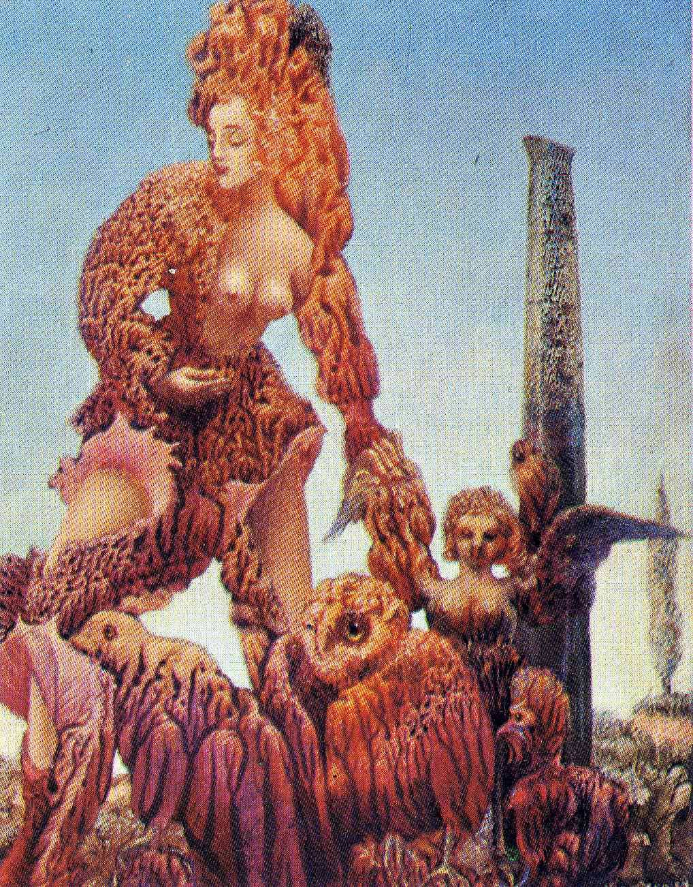

## 基本信息

- 作者：[[恩斯特 Max Ernst]]
- 创作年代：1940
- 副标题 / 别名：Mother and Son
- 材质：布面油画（[[拓印法 Decalcomania]]）(*not from wiki*)
- 现存地：私人收藏 (*not from wiki*)

## 画面与技法

[[拓印法 Decalcomania]] 代表作之一。把颜料涂在玻璃上压在画布上，颜料干后呈现奇妙的**沼泽状或青苔状**肌理；恩斯特再依据这片随机肌理塑造出母子形象。

本课与《[[新娘的婚纱 (恩斯特) Attirement of the Bride]]》《[[单生树与双生树 (恩斯特) Solitary Tree and Married Trees]]》并列展示，作为拓印法的三个典型证据。

## 图片清单

| 编号 | 出自 | 描述 |
|---|---|---|
| 01 | [[093｜契里柯与恩斯特：如何用绘画表现超现实主义？]] | 拓印法生成的肌理上塑造出母子怪诞形象，色调暗红与黄绿 |

## 出现在

- [[093｜契里柯与恩斯特：如何用绘画表现超现实主义？]] — [[拓印法 Decalcomania]] 代表作
