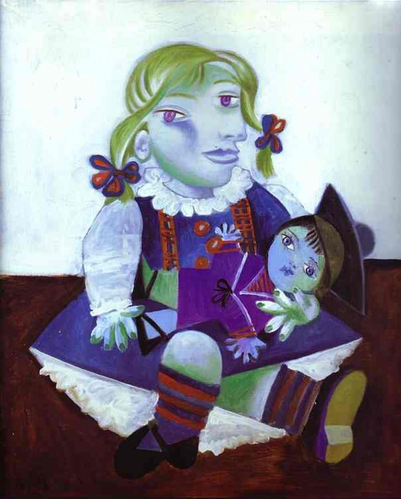

## 基本信息

- 作者：[[毕加索 Pablo Picasso]]
- 创作年代：1938
- 材质：(*not from wiki*) 布面油画
- 尺寸：(*not from wiki*) 73 × 60 cm
- 现存地：(*not from wiki*) Musée Picasso, Paris

## 画面与技法

模特为毕加索与情人 [[玛丽·泰莱斯 Marie-Thérèse Walter]] 的女儿玛雅 (Maya, 1935-生)。画面用**鲜亮的橙绿黄红**呈现 3 岁的玛雅抱着木偶娃娃端坐——双眼一上一下、面部拼贴、人体几何化但保留童真，是 [[综合立体主义 Synthetic Cubism]] 晚期的**亲情题材**样本。

顾衡 067 列入"为情人和家人画肖像、风格高度雷同"的样本之一。

## 历史背景

(*not from wiki*) 玛雅·维德迈尔-毕加索 (Maya Widmaier-Picasso, 1935-) 是毕加索的第一个女儿（私生女、与 [[玛丽·泰莱斯 Marie-Thérèse Walter]] 所生）；毕加索为玛雅画过多幅成长肖像。1986 年起致力于鉴定毕加索作品。

## 图片清单

| 编号 | 出自 | 描述 |
|---|---|---|
| 01 | [[067｜毕加索4：什么是综合立体主义？]] | 整体图（玛雅是毕加索和玛丽·泰莱斯的女儿） |

## 出现在

- [[067｜毕加索4：什么是综合立体主义？]]
