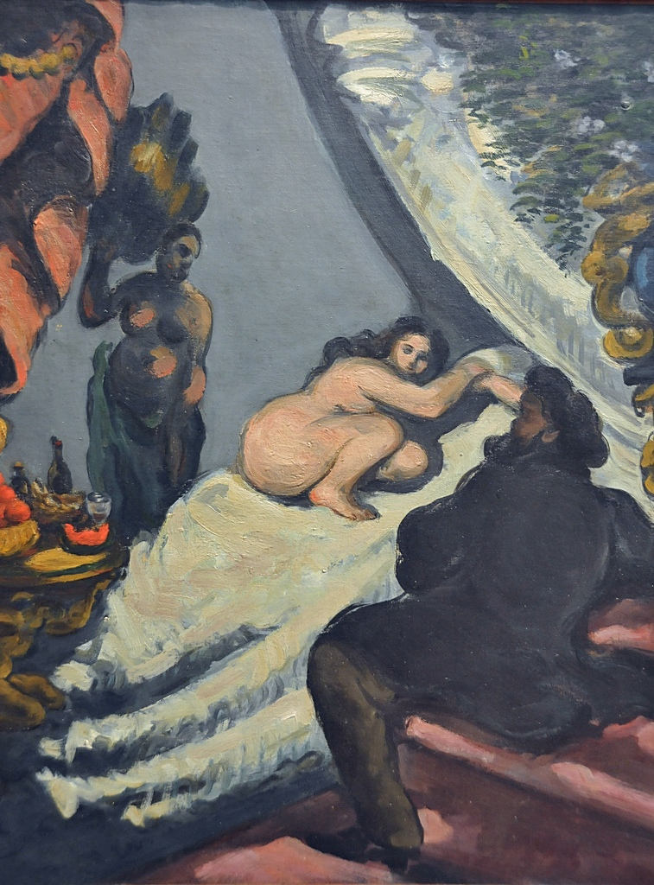

## 基本信息

- 作者：[[塞尚 Paul Cézanne]]
- 创作年代：1869-1870（顾衡 053 标注；现传通常以 1873-1874 第二版为代表 (*not from wiki*)）
- 材质：油彩，画布 (*not from wiki*)
- 尺寸：(*not from wiki*) 46 × 55 cm（第二版）
- 现存地：(*not from wiki*) 奥赛博物馆，巴黎

## 画面与技法

[[塞尚 Paul Cézanne]] 对 [[马奈 Édouard Manet]]《[[奥林匹亚 Olympia|奥林匹亚]]》(1863) 的**戏谑式重画**——把马奈那位平躺直视观者的妓女**"折叠成两半"**（评论家原话），并补上一只**棕色小狗**作为观看见证。**塞尚的入场姿态**：画中右下角自画男像作为消费者向裸女投以目光——把"画家 vs 母题"的关系直接画进画面。

**1874 年第一届印象派画展**（[[印象派首展 (1874) First Impressionist Exhibition]]）的参展作品之一。

## 历史背景 (*not from wiki*)

本作在 1874 印象派首展引发巨大丑闻：评论家说"一个女人被塞尚折叠成了两半，把她所有的丑相暴露给一只棕色的小狗。还记得马奈那幅《奥林匹亚》吗？这么一比，那可是幅杰作。"——10 年前骂马奈最凶的人，现在转过头把马奈追认为杰作来贬塞尚。这是塞尚早期"激进路线"失败的典型证据。

## 图片清单

| 编号 | 出自 | 描述 |
|---|---|---|
| 01 | [[053｜塞尚2：如何打造艺术的平行世界？]] | 全图（顾衡标注 1869-1870 版） |

## 出现在

- [[053｜塞尚2：如何打造艺术的平行世界？]] —— 塞尚 1874 印象派首展参展作品；激进路线的代表
