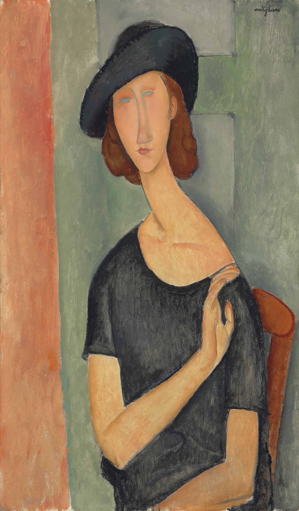

## 基本信息

- 作者：[[莫迪里阿尼 Amedeo Modigliani]]
- 创作年代：1919
- 材质：布面油画 (*not from wiki*)
- 尺寸：(*未知*)
- 现存地：(*未知；多版本散布欧美*) (*not from wiki*)

## 画面与技法

[[莫迪里阿尼 Amedeo Modigliani]] 为妻子 [[珍妮·赫比特娜 Jeanne Hébuterne]] 所作系列肖像之一。延续标准程式——长鼻、长颈、椭圆头；眼睛画法在莫迪里阿尼最后两年中**逐渐由"空白"转向有眼神**——本作处于过渡阶段。

## 历史背景 (*not from wiki*)

珍妮·赫比特娜与莫迪里阿尼 1917 年起同居，1918 年生下女儿（也叫珍妮），1920 年怀第二胎九个月时丈夫病逝，她次日跳楼自尽。

## 图片清单

| 编号 | 出自 | 描述 |
|---|---|---|
| 01 | [[078｜莫迪里阿尼：画中女子为什么让人一眼难忘？]] | 珍妮半身像 |

## 出现在

- [[078｜莫迪里阿尼：画中女子为什么让人一眼难忘？]]
