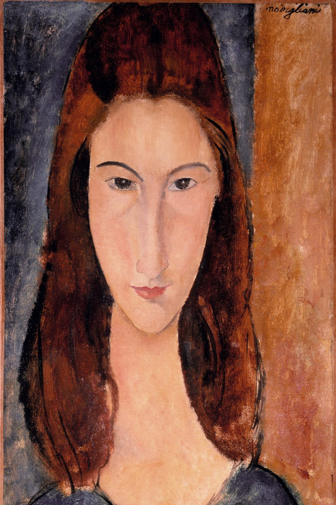

## 基本信息

- 作者：[[莫迪里阿尼 Amedeo Modigliani]]
- 创作年代：1919
- 材质：布面油画 (*not from wiki*)
- 尺寸：(*未知*)
- 现存地：(*未知*) (*not from wiki*)

## 画面与技法

[[莫迪里阿尼 Amedeo Modigliani]] **晚期最催人泪下的一幅肖像**。顾衡 078 在结尾处给出这幅画的关键解读：

> 莫迪里阿尼曾经说："**当我洞悉你的灵魂，我会画出你的眼睛。**" 他确实画过珍妮**睁开眼睛**的样子，但即使是到了今天，这仍然是**令人无法直视的一双眼睛**。

与他所有其他肖像不同——眼神不是空白也不是灰矇，而是**真正"睁开"**了——那双眼睛带着深深的预感与温柔，画完不到一年，珍妮在丈夫去世第二天跳楼自杀，时怀九个月身孕。

## 历史背景 (*not from wiki*)

1919 年莫迪里阿尼身体已极度衰弱；此为他最后一年所作的珍妮肖像之一。

## 图片清单

| 编号 | 出自 | 描述 |
|---|---|---|
| 01 | [[078｜莫迪里阿尼：画中女子为什么让人一眼难忘？]] | 睁开眼睛的珍妮 |

## 出现在

- [[078｜莫迪里阿尼：画中女子为什么让人一眼难忘？]]
