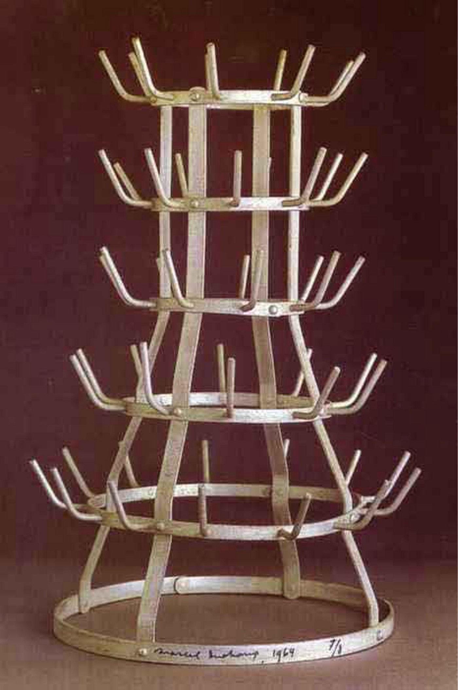

## 基本信息

- 作者：[[杜尚 Marcel Duchamp]]
- 创作年代：1914（原件已佚；后续多版复制） (*not from wiki*)
- 材质：现成品——市售铁制晾瓶架 (*not from wiki*)
- 尺寸：约 64 × 42 cm（1964 复制版） (*not from wiki*)
- 现存地：多版散藏蓬皮杜中心、纽约现代艺术博物馆等 (*not from wiki*)

## 画面与技法

杜尚 1914 年到法国五金店买了一个**晾瓶架**——当时会过日子的法国人家里都有，因为打散装酒用的酒瓶要晾干。"杜尚当时倒是没多想，就是觉得这个酒瓶架当个雕塑放在家里挺好看的。"

这件作品是杜尚**第一件未经动手改造、单纯凭"选择 + 摆放"就被宣告为艺术品**的 [[现成品 Readymade]]——比《[[自行车轮 (杜尚) Bicycle Wheel]]》（1913）的"组合两件现成品"更激进。在后来的现成品谱系里，瓶架被视为"纯粹现成品"(pure readymade) 的开端。(*not from wiki*)

## 历史背景

(*not from wiki*) 原件被杜尚的姐姐 Suzanne 在他 1915 年离开巴黎赴美时清理掉。这个事件他终生郁闷，1936 年起开始亲自重新签名认证一系列复制品，逐步把"原件 vs 复制品"这一传统艺术品概念也彻底瓦解——任何一件市售货架货只要他签上名都是真品。

## 图片清单

| 编号 | 出自 | 描述 |
|---|---|---|
| 01 | [[090｜杜尚3：他为什么要送一个小便器去参展？]] | 晾瓶架——铁制多枝架 |

## 出现在

- [[090｜杜尚3：他为什么要送一个小便器去参展？]]
