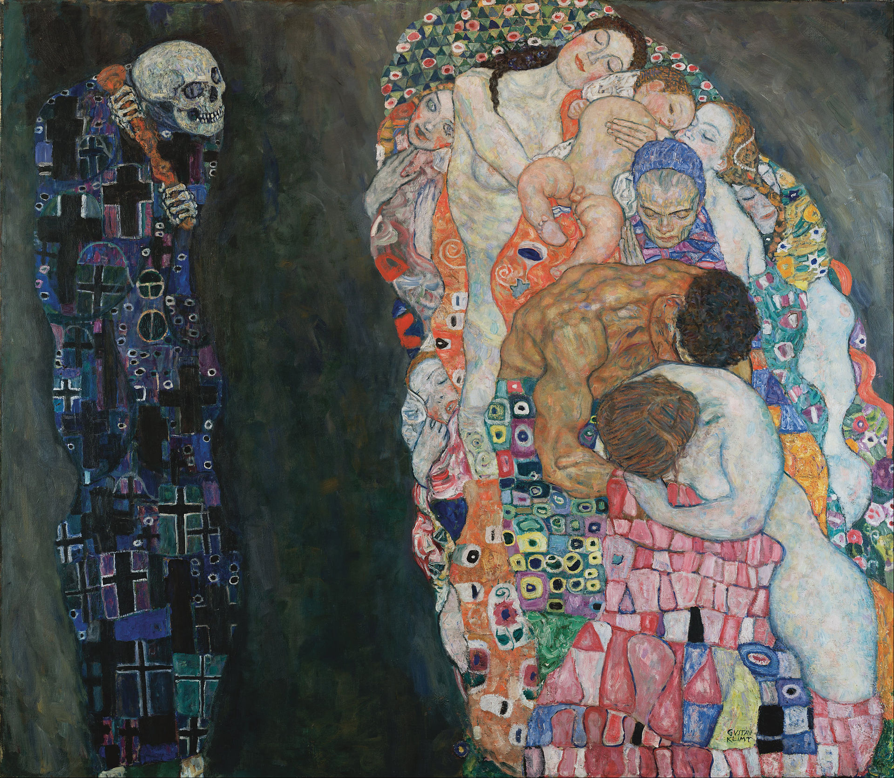

## 基本信息

- 作者：[[克里姆特 Gustav Klimt]]
- 创作年代：1910–1915
- 材质：（*not from wiki*）布面油画
- 尺寸：（*not from wiki*）178 × 198 cm
- 现存地：（*not from wiki*）维也纳 Leopold Museum

## 画面与技法

[[克里姆特 Gustav Klimt]] **象征性**风格代表作之一。顾衡 073 解码：

> 生命的各个阶段被挤压成**一个子宫形状**，死神当然被画成一个**骷髅**，他略带嘲讽地观察着他的猎物，却并不急于享用。**人生的无常、无奈和无望，莫过于此**。

构图：左侧死神持斧、披黑底彩斑装饰长袍 / 右侧生命群像被压缩为一个椭圆构图——子宫 / 卵形容器与外部死神并置。

## 历史背景 (*not from wiki*)

- 1911 罗马国际艺术展首次展出获金奖
- 后被克里姆特反复修改，最终 1915 年的版本即现存版本

## 图片清单

| 编号 | 出自 | 描述 |
|---|---|---|
| 01 | [[073｜克里姆特：什么是维也纳分离派？]] | 生命与死亡全图 |

## 出现在

- [[073｜克里姆特：什么是维也纳分离派？]]
