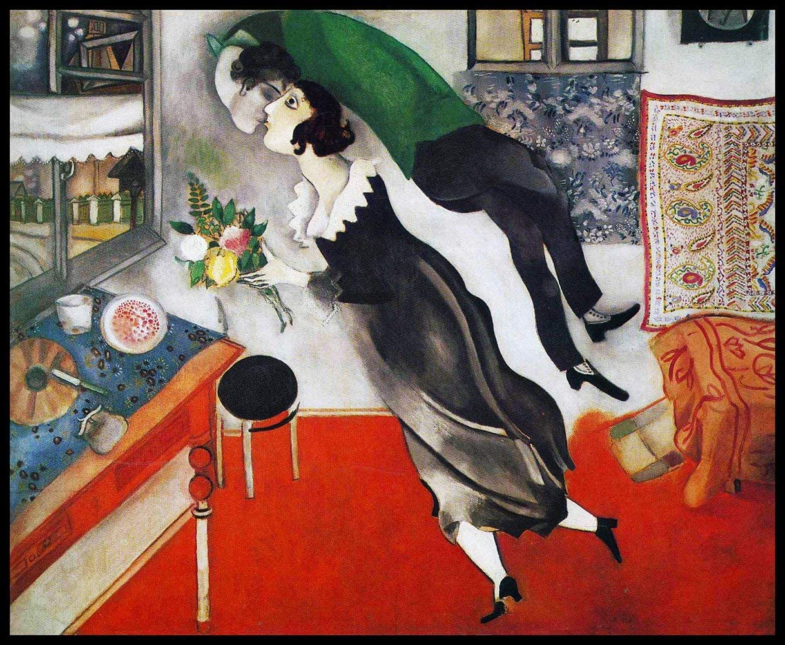

## 基本信息

- 作者：[[夏加尔 Marc Chagall]]
- 模特：[[贝拉·罗森菲尔德 Bella Rosenfeld]]
- 创作年代：1915
- 材质：纸板油画 (*not from wiki*)
- 尺寸：约 80.6 × 99.7 cm (*not from wiki*)
- 现存地：纽约现代艺术博物馆 (MoMA) (*not from wiki*)

## 画面与技法

夏加尔以贝拉生日为题创作的系列中**最著名的一幅**（顾衡 077）。

画面读解：

- **夏加尔自由地在空中漂浮**
- **以不可思议的姿势扭过头来亲吻他心爱的妻子**
- "**表达了对生活的心满意足**"

顾衡引夏加尔自己的话："**当你初尝爱情滋味时，就明白我画的是什么了……只要一打开窗，她就在这里，带来了碧空、爱情与鲜花。从古老的时候起直至今日，她都翱翔于我的画中，照亮我的艺术道路。**"

## 历史背景 (*not from wiki*)

1915 年夏加尔与贝拉在维切布斯克结婚。此画作于婚礼前不久（贝拉 7 月生日）——是夏加尔**每年贝拉生日都要画一幅肖像**这一惯例的开端之一。

## 图片清单

| 编号 | 出自 | 描述 |
|---|---|---|
| 01 | [[077｜夏加尔：俄国人在巴黎]] | 漂浮的夏加尔扭头亲吻贝拉 |

## 出现在

- [[077｜夏加尔：俄国人在巴黎]] —— 贝拉生日组画最著名一幅
