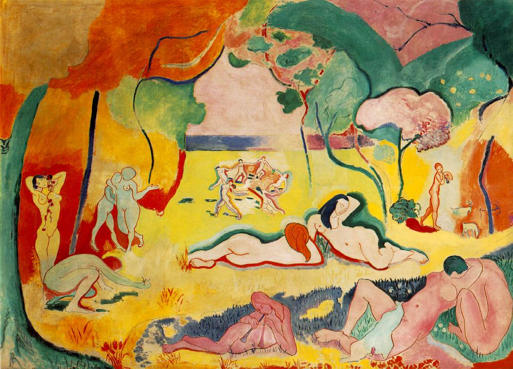

## 基本信息

- 作者：[[马蒂斯 Henri Matisse]]
- 创作年代：1905–1906
- 材质：布面油画 (*not from wiki*)
- 尺寸：约 176.5 × 240.7 cm (*not from wiki*)
- 现存地：美国宾州 Merion · 巴恩斯基金会 (The Barnes Foundation) (*not from wiki*)

## 画面与技法

田园 (Arcadian) 场景：一片明亮鲜艳的森林空地上，**裸体男女三五成群**：远处有一圈手拉手跳舞的人 (即后来 1909–1910 [[舞蹈 La Danse]] 的雏形 (*not from wiki*))；近景一对情人接吻 (姑娘连个头都没画)；中景有人吹笛、躺卧、采花。整幅画在两年的修改中越改越简。

形式与技法：

- **风格上接近 [[高更 Paul Gauguin]] 塔希提时期**：封闭的轮廓线、大面积平涂、鲜艳色彩；
- **主题也是高更式的**：原始人 + 大自然的"伊甸园"母题；
- **但是简化走得更远**：远处跳舞的人只剩几笔线条；近景接吻的姑娘"连个头都没有"——[[马蒂斯 Henri Matisse]] 的老师 [[莫罗 Gustave Moreau]] 曾断言"亨利，你是为简化绘画而生的"，本画是这条预言的兑现；
- **掠夺式借鉴非欧洲艺术**：日本浮世绘 + 西非原始部落雕塑的造型语言被融入——与 [[高更 Paul Gauguin]] 的塔希提取材同一路线；
- **完全放弃纵深**：色彩获得彻底自由——[[德朗 André Derain]] 的"为色彩而色彩"口号在大尺幅田园场景上的实现。

[[马蒂斯 Henri Matisse]] 对此简化的辩护：

> 表达细节是摄影的事儿，摄影干这个要好得多、快得多。艺术，则是以最简单的方法，尽可能直接表达属于感情范围之内的东西……细节化会破坏线条的纯粹并减弱感觉力。

本画不引入任何 [[象征主义 Symbolism]] 式的"密电码"——颜色和形象不指向画外的固定意义，**装饰性** 本身就是目的。

## 历史背景 (*not from wiki*)

- 1906 年在独立沙龙 (Salon des Indépendants) 展出，引发巨大争议——既被前卫派奉为新方向，也激怒了 [[西涅克 Paul Signac]] (西涅克："马蒂斯完全堕落了，他用了拇指粗的线条，然后用令人作呕的颜色进行涂抹")，标志马蒂斯与 [[新印象主义 Neo-Impressionism]] 的彻底决裂。
- 被 [[斯泰因兄妹 Leo & Gertrude Stein]] (实为 Leo Stein) 买下，后归 Albert C. Barnes，今藏巴恩斯基金会。
- 本作直接刺激毕加索画出 [[亚维农的少女 Les Demoiselles d'Avignon]] (1907) 作为应战，开启立体主义。

## 图片清单

| 编号 | 出自 | 描述 |
|---|---|---|
| 01 | [[061｜马蒂斯2：为什么说野兽派不"野兽"？]] | 整幅画面 |

## 出现在

- [[061｜马蒂斯2：为什么说野兽派不"野兽"？]] —— 作为"为什么野兽派被迅速接受"的样本作品
