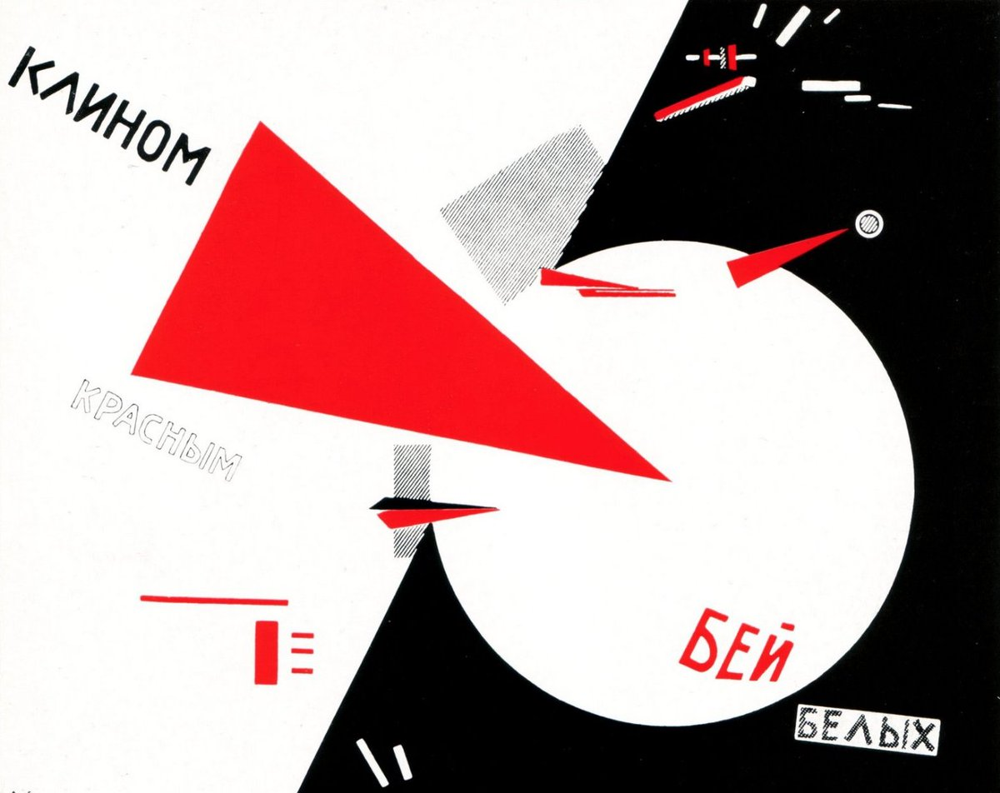

## 基本信息

- 作者：[[利西茨基 El Lissitzky]]
- 创作年代：1919
- 材质：石版印刷海报 (*not from wiki*)
- 尺寸：49.3 × 69.2 cm (*not from wiki*)
- 现存地：阿姆斯特丹市立博物馆等多版本馆藏 (*not from wiki*)

## 画面与技法

俄国内战 (1918–1922) 期间为红军宣传所作的政治海报——红色尖锐三角形（红楔 = 苏维埃红军）刺穿白色圆形（白军）。**纯几何抽象语汇** + **明确的政治叙事**——这正是 [[构成主义 Constructivism]] **"艺术为革命服务、为人民服务"** 主张的最典型样本。

顾衡 086 评点：塔特林上任"人民启蒙委员会视觉艺术部莫斯科支部书记"后，"提出'为艺术而艺术'是腐朽没落的资产阶级理念……麻溜的赶紧，工人工作服设计起来，房子设计起来，海报设计起来。其中最典型的作品，就是塔特林的小伙伴 [[利西茨基 El Lissitzky]] 的这幅海报。"

## 历史背景 (*not from wiki*)

利西茨基本是 [[马列维奇 Kazimir Malevich]] 在维捷布斯克艺术学校的学生兼同事——1919–1923 年他把 [[至上主义 Suprematism]] 的几何语言**功能化、政治化**，发明了介乎海报、招贴与建筑透视图之间的形式语汇，史称 PROUN ("新事物确认计划")。本作是这一转向的代表，**直接启发了 1920 年代的现代主义平面设计**。

## 图片清单

| 编号 | 出自 | 描述 |
|---|---|---|
| 01 | [[086｜塔特林：什么是构成主义？]] | 海报全图 |

## 出现在

- [[086｜塔特林：什么是构成主义？]]
