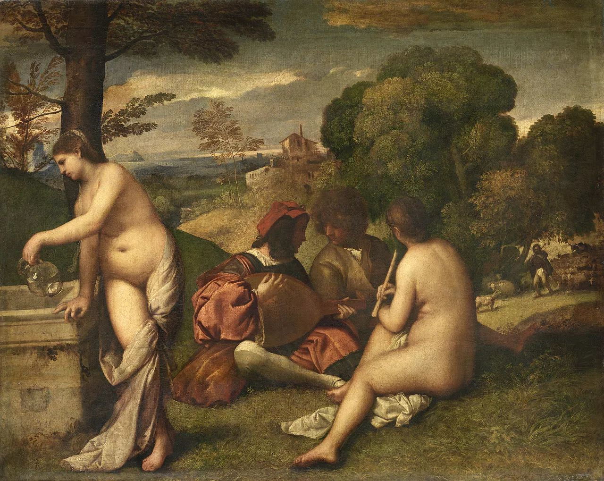

## 基本信息

- 作者：[[提香 Titian]]（18 世纪前归在 [[乔尔乔内 Giorgione]] 名下；归属至今仍有争议）(*not from wiki*)
- 创作年代：1510-1511
- 材质：布面油画
- 尺寸：105 × 137 cm (*not from wiki*)
- 现存地：卢浮宫 (*not from wiki*)

## 画面与技法

两位贵族青年在户外坐谈奏乐，旁伴两位裸女——一手提水罐、一手拿长笛。

**顾衡解读**（016）：取材自亚里士多德《诗学》——
- 手提水罐裸女 = **悲剧诗**（境界最高）
- 手拿长笛裸女 = **田园诗**
- 两位贵族青年 = **抒情诗**（较低）

"合奏"的两层含义：
1. 三种诗歌形象同框
2. 两位裸女是**缪斯化身**（凡间诗人才气的具象），对青年"不可见"——神凡两界在平行空间合奏。

风景部分体现 [[威尼斯画派 Venetian School]] 从师傅 [[乔万尼·贝利尼 Giovanni Bellini]] 学到的真东西——风景的表现。提香的风景在细腻上超过达·芬奇式的朦胧。

## 历史背景

(*not from wiki*) 名字"合奏"是 18 世纪后改的，原名仅"田园曲" *Concert champêtre*。是马奈 *Le Déjeuner sur l'herbe* (1863) 的明确引用对象——延续"穿衣男 + 裸女"户外构图。

## 图片清单

| 编号 | 出自 | 描述 |
|---|---|---|
| 01 | [[016｜提香：为什么业界评价比达芬奇还高？]] | 整体图 |

## 出现在

- [[016｜提香：为什么业界评价比达芬奇还高？]]
