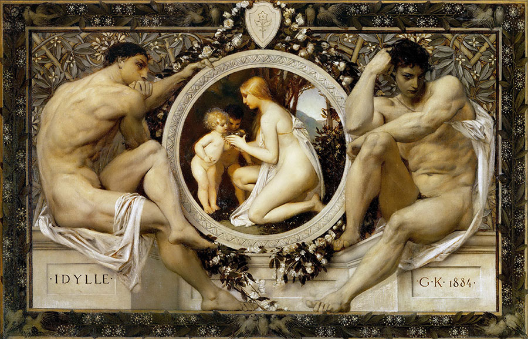

## 基本信息

- 作者：[[克里姆特 Gustav Klimt]]
- 创作年代：1884
- 材质：（*not from wiki*）油画
- 尺寸：（*not from wiki*）
- 现存地：（*not from wiki*）维也纳博物馆 Wien Museum

## 画面与技法

[[克里姆特 Gustav Klimt]] 早期作品——典型的 [[学院派 Academic Art]] 古典绘画，"在古典绘画上有很深的造诣"，顾衡评价"这水平，搁在法国官方沙龙展里也是个**获奖水平**"（073）。

## 历史背景 (*not from wiki*)

22 岁的克里姆特刚出维也纳工艺美术学院，是当时维也纳官方艺术界的"当红炸子鸡"——博物馆、歌剧院之类公共建筑都请他画壁画。本作品时期他还完全在学院派轨道上。

## 图片清单

| 编号 | 出自 | 描述 |
|---|---|---|
| 01 | [[073｜克里姆特：什么是维也纳分离派？]] | 田园牧歌全图 |

## 出现在

- [[073｜克里姆特：什么是维也纳分离派？]]
