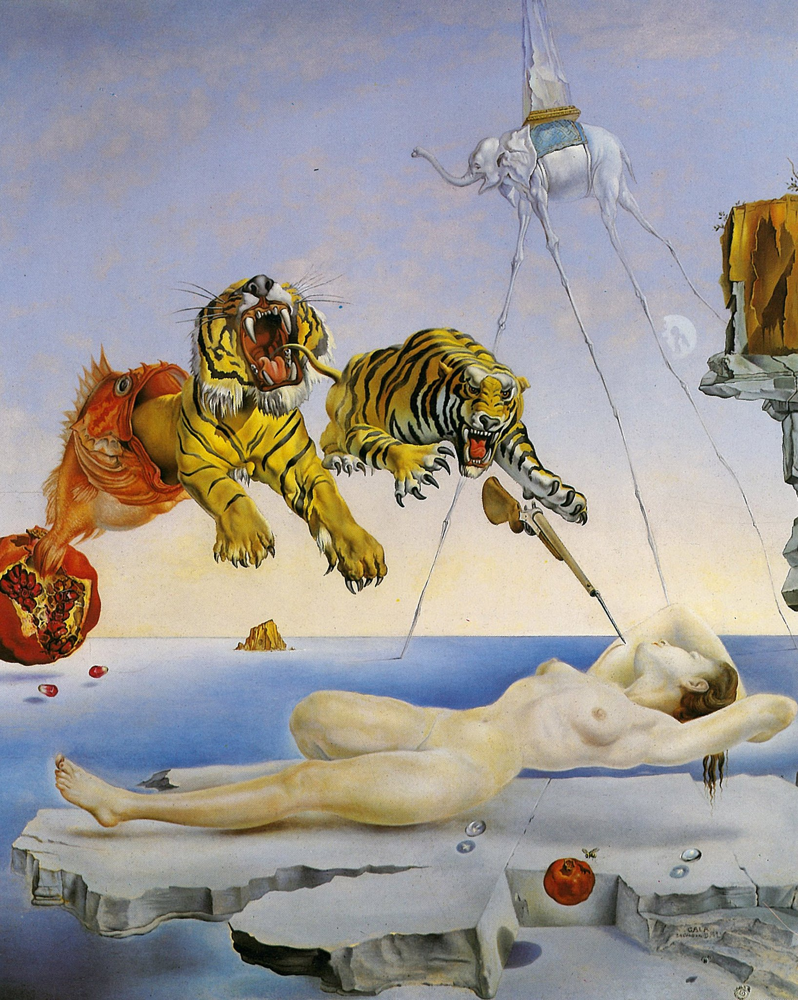

## 基本信息

- 作者：[[达利 Salvador Dalí]]
- 创作年代：1944
- 材质：木板油画 (*not from wiki*)
- 尺寸：(*not from wiki*) 51 × 41 cm
- 现存地：(*not from wiki*) 马德里提森-博内米萨博物馆（Museo Thyssen-Bornemisza, Madrid）

## 画面与技法

094 中作为达利**梦境派叙事**的标准样本登场。顾衡逐元素解读：

> "一只蜜蜂围着一个石榴飞，发出的嗡嗡声引发了睡着的加拉被蛰的恐惧，由此引发了一个以逃跑为主题的梦。**鱼从石榴中逃跑，老虎从鱼嘴里挣脱，扑向加拉，又变身为上了刺刀的步枪**。"

弗洛伊德式诠释：
- **石榴 = [[加拉 Gala Dalí]] 对性的渴望**
- **蜜蜂介入** → 渴望经精神分析教科书般的链路转化 → **对男性暴力的恐惧**
- 一只小石榴 + 飞舞蜜蜂位于左下；裸睡加拉悬空于岩石；右后大石榴中迸出鱼；鱼口吐双虎；最右一支步枪刺刀抵向加拉肩胛

094 中达利此画与《[[记忆的永恒 (达利) The Persistence of Memory]]》并列，作为"达利的画**有完整的故事性**——区别于恩斯特画中各元素互不关联"的核心论据。

## 历史背景 (*not from wiki*)

绘于达利二战流亡美国期间（1940–1948 阶段）。达利当时已被 [[布勒东 André Breton]] 开除出超现实主义阵营六年，处于**完全商业化但艺术依然精到**的高产期。

## 图片清单

| 编号 | 出自 | 描述 |
|---|---|---|
| 01 | [[094｜达利：为什么他画的是"伪装的梦"？]] | 全图 |

## 出现在

- [[094｜达利：为什么他画的是"伪装的梦"？]]
