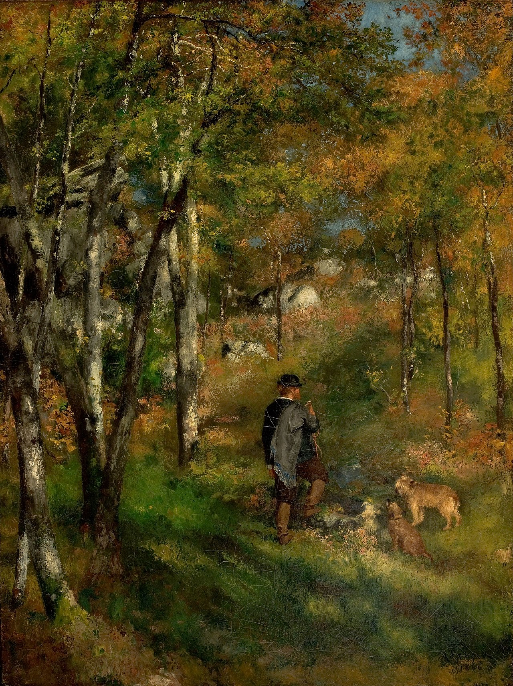

## 基本信息

- 作者：[[雷诺阿 Pierre-Auguste Renoir]]
- 创作年代：1866
- 材质：布面油画 (*not from wiki*)
- 尺寸：106 × 80 cm (*not from wiki*)
- 现存地：圣保罗艺术博物馆 Museu de Arte de São Paulo (*not from wiki*)

## 画面与技法

雷诺阿早期与 [[莫奈 Claude Monet]] 一起深受 [[巴比松画派 Barbizon School]] 影响阶段的代表作。画面是雷诺阿好友、画家儒勒·勒柯尔 (Jules Le Cœur) 带着狗在枫丹白露森林中散步。

043 顾衡明确：和 [[柯罗 Camille Corot]] 相比，雷诺阿这个阶段的**风景画要明亮很多，明暗对比来得更直接**——不像柯罗那样细腻和朦胧。这与 041 中莫奈"白色打底"、亮度抬升的方向同步，但雷诺阿走得更直接、对比更强。

## 历史背景 (*not from wiki*)

雷诺阿与莫奈、巴齐依、西斯莱在 [[格莱尔 Charles Gleyre]] 画室相识后，1864 年起一同到枫丹白露森林写生；本作正是这一时期的产物。儒勒·勒柯尔本人也是画家，是雷诺阿早期重要的同伴与赞助小圈子的一员。

## 图片清单

| 编号 | 出自 | 描述 |
|---|---|---|
| 01 | [[043｜雷诺阿：妥协如何造就大师？]] | 全图，森林中带狗散步的男人 |

## 出现在

- [[043｜雷诺阿：妥协如何造就大师？]]
