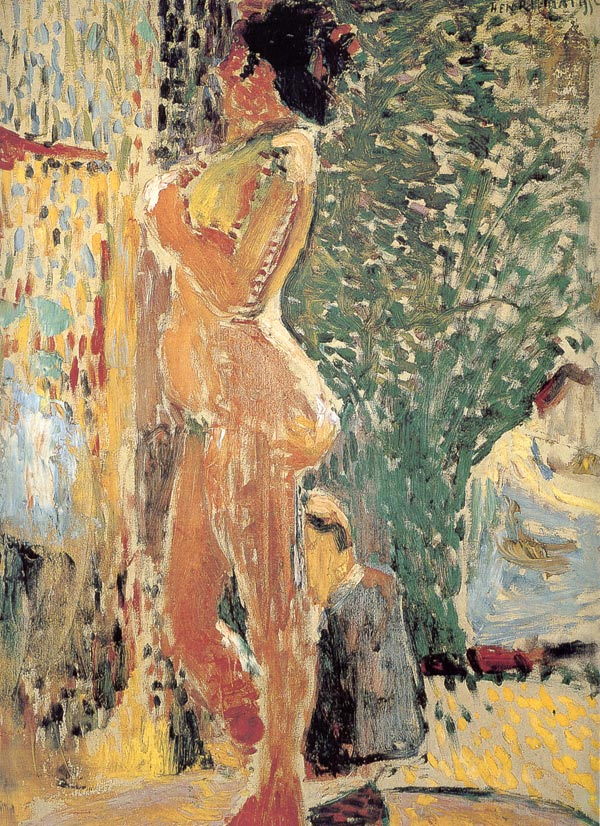

## 基本信息

- 作者：[[马蒂斯 Henri Matisse]]
- 创作年代：1899
- 材质：油彩，画布 (*not from wiki*)
- 现存地：(*not from wiki*)

## 画面与技法

[[马蒂斯 Henri Matisse]] **混搭风格代表作**（060 明示）—— "**马蒂斯对于新印象主义绘画理念还是有所保留的**"。本作展示马蒂斯 1899 年前后**塞尚 + 凡·高 + 点彩派**三层混搭：

- **人体塑造**：主要是 [[塞尚 Paul Cézanne]] 式，**或许还借鉴了一点 [[凡·高 Vincent van Gogh]]**
- **背景**：[[西涅克 Paul Signac]] 的**小点子只让出现在背景处**——马蒂斯**不让点彩派吃掉前景人体**

同一时期，[[马尔凯 Albert Marquet]] 也表现出同样的混搭风格（060 对比 [[圣阿德莱斯的沙滩 The Beach at Sainte-Adresse]]）。

## 历史背景 (*not from wiki*)

1899 年是马蒂斯被西涅克邀请度假后**全面了解新印象主义理念、开始向点彩派转型**的关键年。但本作显示——**转型并不彻底**，马蒂斯有自己的保留。

## 图片清单

| 编号 | 出自 | 描述 |
|---|---|---|
| 01 | [[060｜马蒂斯1：野兽派从何而来？]] | 全图——塞尚+凡·高人体 + 点彩背景的混搭 |

## 出现在

- [[060｜马蒂斯1：野兽派从何而来？]]
