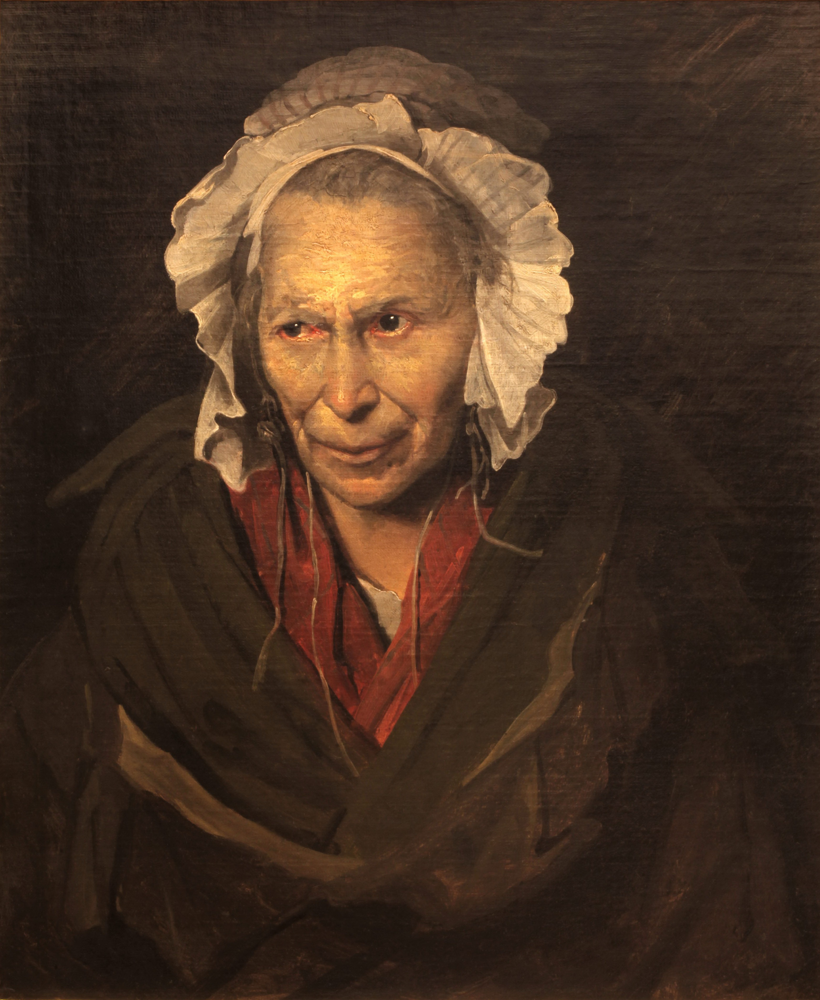

## 基本信息

- 作者：[[籍里柯 Théodore Géricault]]
- 创作年代：1822 (*not from wiki* 部分文献标 1819–1822 系列)
- 材质：布面油画 (*not from wiki*)
- 尺寸：(*not from wiki*) 72 × 58 cm
- 现存地：(*not from wiki*) 法国里昂美术博物馆 (Musée des Beaux-Arts de Lyon)

## 画面与技法

(*not from wiki*) 一位戴白色软帽、红披肩、目光斜射的老妇人——眼神涣散但**燃着压抑的恨意**——通常被认为是"**嫉妒型偏执狂**"的肖像。籍里柯**不美化、不象征化**地画一个真实的精神病人——身份、年龄、情绪都直白；这与新古典主义"理想化人体"传统形成尖锐对立。

本作是籍里柯**精神病院系列**（约 10 幅，今存 5 幅，分别对应不同精神疾病类型）中流传最广的一幅。他的一位朋友是精神病院医生，正打算写本书，请籍里柯去画病人；这一组肖像成为**浪漫主义"情感强度"取代"理念美"**的临床版样本。

## 历史背景

(*not from wiki*) 19 世纪初的法国精神病学正在脱离"道德缺陷"的旧观点、走向把疯狂当作**可分类的疾病**——这组肖像同时也是早期精神病学的视觉档案。

## 在课程中的角色

顾衡 034 用本画作"**籍里柯果然是我们自己人**"的浪漫主义认证证据——题材的**边缘性**（疯子）+ 处理的**情感直击力**+ **对学院派理想化人体的破坏**——三者合并使得报纸上的浪漫主义评论家把籍里柯**树为浪漫主义一哥**。

## 图片清单

| 编号 | 出自 | 描述 |
|---|---|---|
| 01 | [[034｜德拉克罗瓦：为什么他成了浪漫主义的旗手？]] | 全画 |

## 出现在

- [[034｜德拉克罗瓦：为什么他成了浪漫主义的旗手？]] —— 籍里柯被浪漫主义评论家拥立为旗手的认证作品
