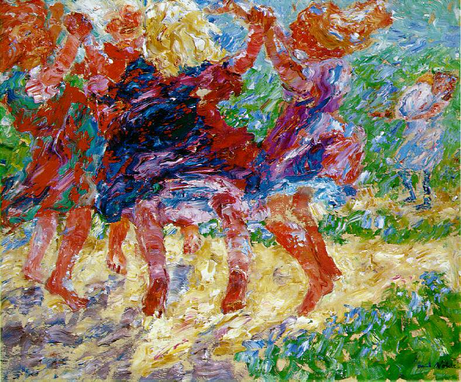

## 基本信息

- **作者**：[[诺尔德 Emil Nolde]]
- **创作年代**：1909
- **材质**：布面油画 (*not from wiki*)
- **尺寸**：73 × 87 cm (*not from wiki*)
- **现存地**：基尔美术馆 Kunsthalle zu Kiel (*not from wiki*)

## 画面与技法

- 072 中作为诺尔德**"形的崩溃"标志性三联例**之一（与 [[蜡烛与舞者 (诺尔德) Candle Dancers]]、[[围着金牛犊的舞蹈 (诺尔德) Dance Around the Golden Calf]] 并列）。
- 不再是"法国货的混搭"——加入了**北方德国人的哥特式激情**和**对原始宗教激情的倾慕和向往**。
- **重心是色彩**——"色彩是我的音符，用来勾画相和谐又相抵触的音响及和弦。"

## 历史背景 (*not from wiki*)

1909 是诺尔德绘画语言的关键转折年——同年他被 [[桥社 Die Brücke]] 邀请加入（已三年），即将形成自己**专属表现主义语言**。

## 图片清单

| 编号 | 出自 | 描述 |
|---|---|---|
| 01 | [[072｜桥社：什么是表现主义绘画的使命？]] | Wildly Dancing Children 1909 — 形崩溃 |

## 出现在

- [[072｜桥社：什么是表现主义绘画的使命？]]
