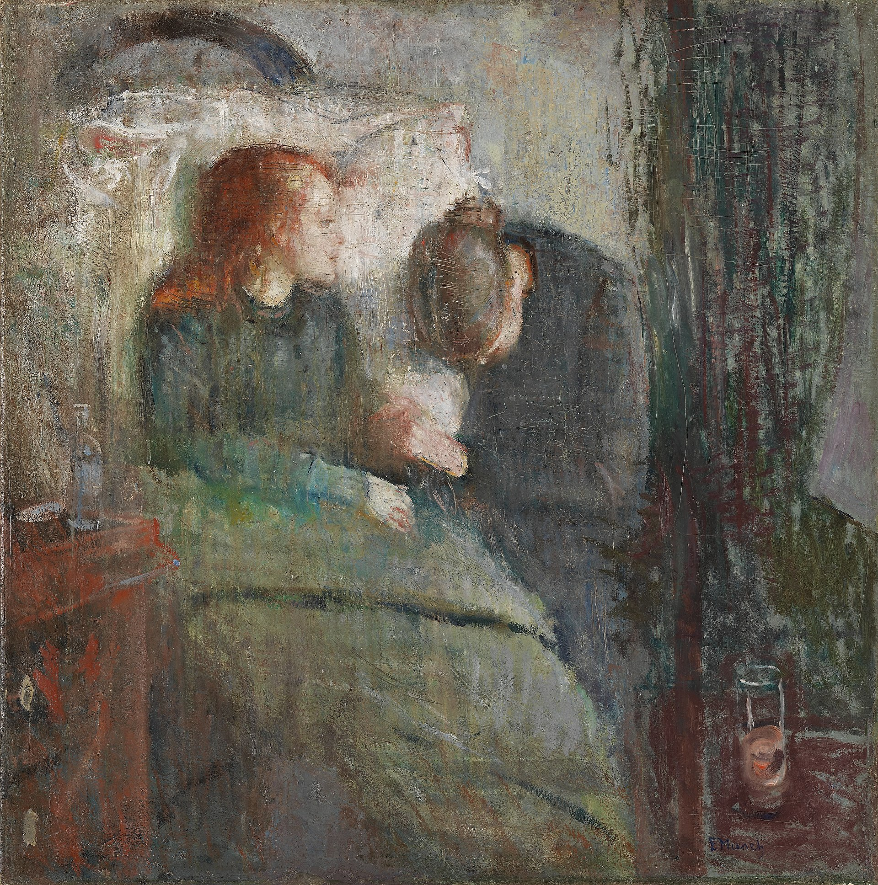
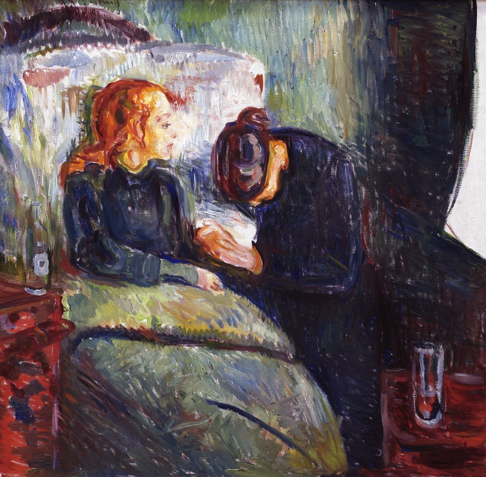

## 基本信息

- 作者：[[爱德华·蒙克 Edvard Munch]]
- 创作年代：1885（首版）；蒙克差不多每十年重画一遍——本 wiki 收 **1885 & 1907** 两版（顾衡 070）
- 材质：布面油画 (*not from wiki*)
- 尺寸：未注明
- 现存地：1885 版藏挪威国家博物馆 (*not from wiki*)

## 画面与技法

表现姐姐 [[苏菲·蒙克 Sophie Munch]] 病重时的情景——女孩儿苍白侧脸 + 床头悲恸的母亲（或姨母）。蒙克自述："这是我艺术创作的一项突破，我以后的作品，都应该归功于这幅画的诞生。"（顾衡 070）。

**1885 版**：1886 奥斯陆展出时**恶评一片**，让蒙克在 1889 《[[夏之夜 Inger on the Beach]]》中暂时回到更传统的学院派风格。

**1907 版**：1889 巴黎奖学金游学后所作——**在透视压缩和细节简化方面，比之前走得更远**（顾衡 070）。

## 历史背景 (*not from wiki*)

蒙克一生重画此作至少 6 个版本（1885、1896、1907、1925 等），是他"母题反复"创作模式最典型的例证。

## 图片清单

| 编号 | 出自 | 描述 |
|---|---|---|
| 01 | [[070｜蒙克1：表现主义的先行者经历了什么？]] | 1885 首版 |
| 02 | [[070｜蒙克1：表现主义的先行者经历了什么？]] | 1907 版——透视压缩 + 细节简化 |

## 出现在

- [[070｜蒙克1：表现主义的先行者经历了什么？]]
