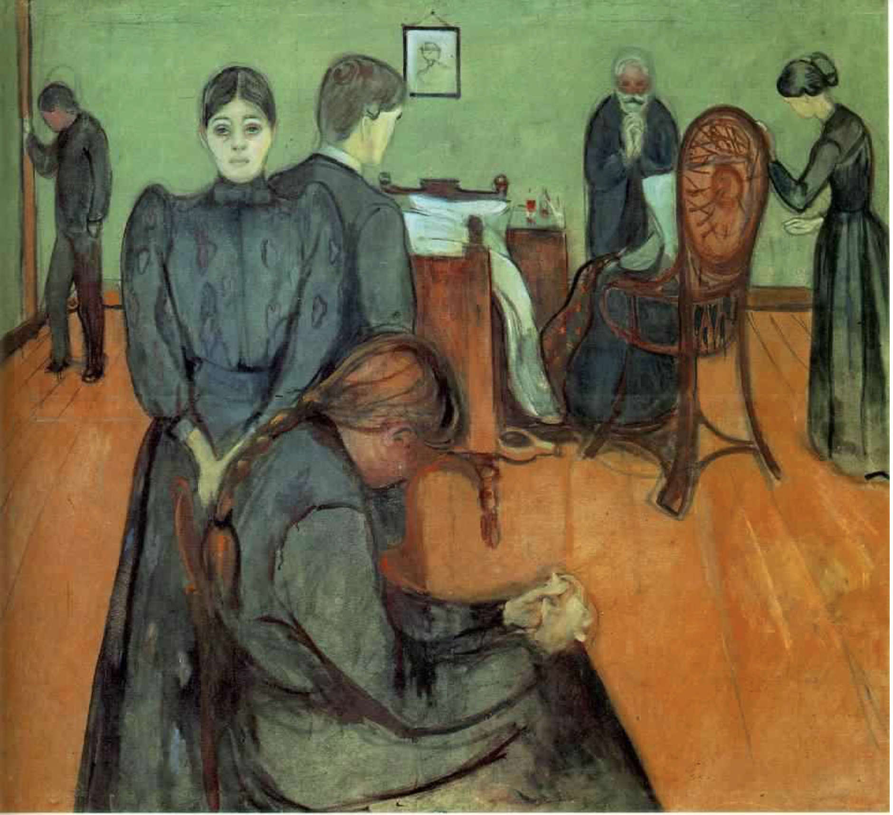

## 基本信息

- 作者：[[爱德华·蒙克 Edvard Munch]]
- 创作年代：1895
- 材质：布面油画 (*not from wiki*)
- 尺寸：未注明
- 现存地：未注明

## 画面与技法

姐姐 [[苏菲·蒙克 Sophie Munch]] 弥留之际坐在椅子上的情景的再现——蒙克的父亲是宗教狂，临终强令姐姐爬起坐于椅上唱赞美诗，**姐姐就是在椅子上咽气的**（顾衡 070）。画面把家人分散为各自独立的悲痛个体，没有一人在画面中心；空椅成视觉焦点——死者在场而又缺席。

## 历史背景 (*not from wiki*)

蒙克 5 岁丧母（结核）、13 岁丧大姐 [[苏菲·蒙克 Sophie Munch]]（同样死于结核）。挪威当时结核发病率高达 0.3%。**疾病、死亡，以及剪不断理还断的情感纠葛**成为蒙克一生反复出现的创作主题（顾衡 070）。

## 图片清单

| 编号 | 出自 | 描述 |
|---|---|---|
| 01 | [[070｜蒙克1：表现主义的先行者经历了什么？]] | 家人围绕病榻 + 空椅 |

## 出现在

- [[070｜蒙克1：表现主义的先行者经历了什么？]]
