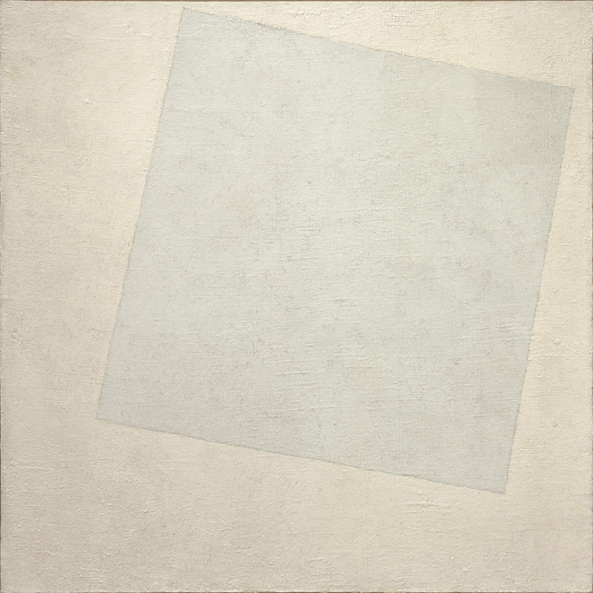

## 基本信息

- 作者：[[马列维奇 Kazimir Malevich]]
- 创作年代：1918
- 材质：布面油画 (*not from wiki*)
- 尺寸：79.4 × 79.4 cm (*not from wiki*)
- 现存地：美国纽约现代艺术博物馆 MoMA (*not from wiki*)

## 画面与技法

[[至上主义 Suprematism]] **白色阶段**的终极作品：白色画布上一个略微倾斜的白色方块——靠极细微的色温差异（暖白 / 冷白）区分图与底。

[[马列维奇 Kazimir Malevich]] 自释："**上面那个方块＝感觉，下面那个白底方块＝不存在的感觉。**这是至上主义的终极作品，是绘画的最高喜悦，因为它代表了人的意志脱离了它的物质性，而融汇于无限之中……"

顾衡 083 自评："你听懂了吗？反正我是没听懂。"

## 历史背景

马列维奇将 [[至上主义 Suprematism]] 解释为一个**光谱**，分三阶段：

- **黑方块** = 经济的信号 → [[黑方块 Black Square]] (1915)
- **红方块** = 革命的信号 → [[红色方块 Red Square (Malevich)|红色方块]] (1915)
- **白方块** = 纯粹的行动 → 本作 (1918)

## 图片清单

| 编号 | 出自 | 描述 |
|---|---|---|
| 01 | [[083｜马列维奇：什么是至上主义？]] | 全画 |

## 出现在

- [[083｜马列维奇：什么是至上主义？]]
