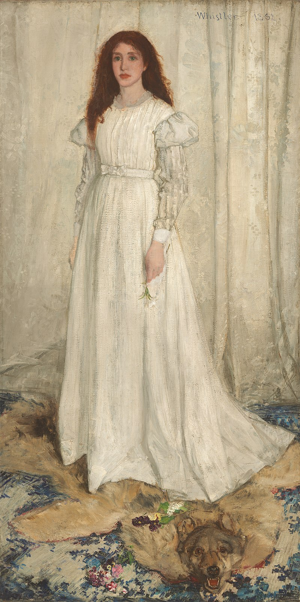

## 基本信息

- 作者：[[惠斯勒 James Whistler]]
- 创作年代：1862
- 材质：（*not from wiki*）布面油画
- 尺寸：（*not from wiki*）213 × 107.9 cm
- 现存地：（*not from wiki*）华盛顿国家美术馆 National Gallery of Art

## 画面与技法

顾衡 073 把它作为**20 世纪初维也纳上流社会追捧的肖像样式标杆**引出——"美国肖像画家 [[惠斯勒 James Whistler]] 很时髦"。

[[克里姆特 Gustav Klimt]] 技术上"照葫芦画瓢实在是小菜一碟"——这个样式构成了克里姆特名媛肖像（[[艾米莉·弗洛奇肖像 Portrait of Emilie Flöge]] / [[阿黛尔夫人像 Adele Bloch-Bauer]]）的姿态来源。

## 历史背景 (*not from wiki*)

- 模特是惠斯勒情人乔安娜·希弗南 Joanna Hiffernan
- 1863 年被巴黎沙龙拒收，与马奈《草地上的午餐》一同在 [[落选者沙龙 Salon des Refusés]] 引发轰动

## 图片清单

| 编号 | 出自 | 描述 |
|---|---|---|
| 01 | [[073｜克里姆特：什么是维也纳分离派？]] | 白衣少女全图 |

## 出现在

- [[073｜克里姆特：什么是维也纳分离派？]]
