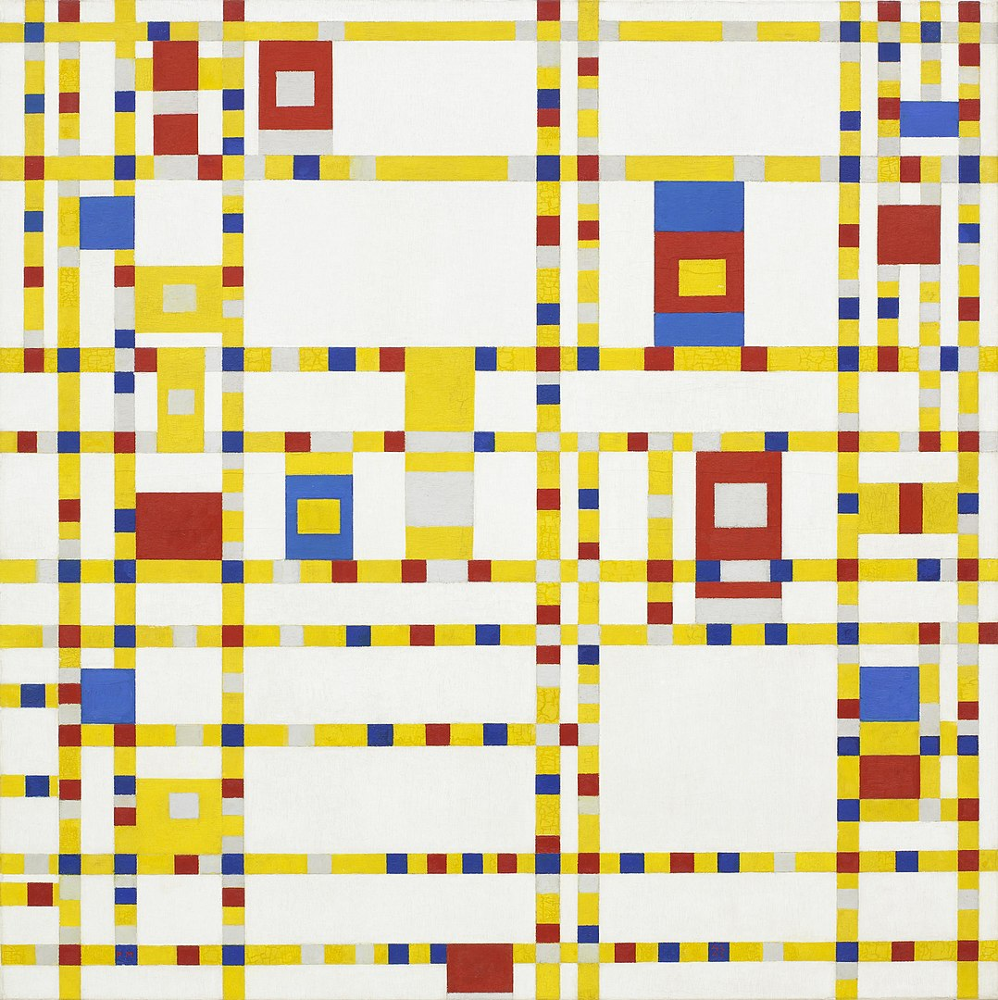

## 基本信息

- 作者：[[蒙德里安 Piet Mondrian]]
- 创作年代：1942–1943
- 材质：(*not from wiki*：布面油画)
- 尺寸：(*not from wiki*：约 127 × 127 cm，方画布)
- 现存地：(*not from wiki*：纽约现代艺术博物馆 MoMA)

## 画面与技法

蒙德里安 1940 年因二战避难至纽约后的代表作，也是他抽象创作的**最后一次重大语法调整**：

- **以往的黑线条被彩色线条取代**——红、黄、蓝小色块沿水平 / 垂直方向排列成若干小节段，模拟爵士乐欢快的节奏。
- 仍严格遵守"只允许横线和竖线"的 [[新造型主义 Neo-Plasticism]] 原则——色块仍是矩形。

## 历史背景 (*not from wiki*)

"穿着白大褂画方格子的巫师"在纽约狂热爱上了爵士乐与爵士舞——朋友们都说他的"舞姿实在是不敢恭维"。顾衡推测："他大概是想，爵士乐这么个好东西，神也应该是喜欢的吧？"——这幅画也是他这一辈子与更高级智慧沟通的最后一次努力。**画完没多久，他就离开了人世。**

## 图片清单

| 编号 | 出自 | 描述 |
|---|---|---|
| 01 | [[084｜蒙德里安：他为什么要画那么多格子？]] | 百老汇的爵士乐（1942–1943） |

## 出现在

- [[084｜蒙德里安：他为什么要画那么多格子？]]
