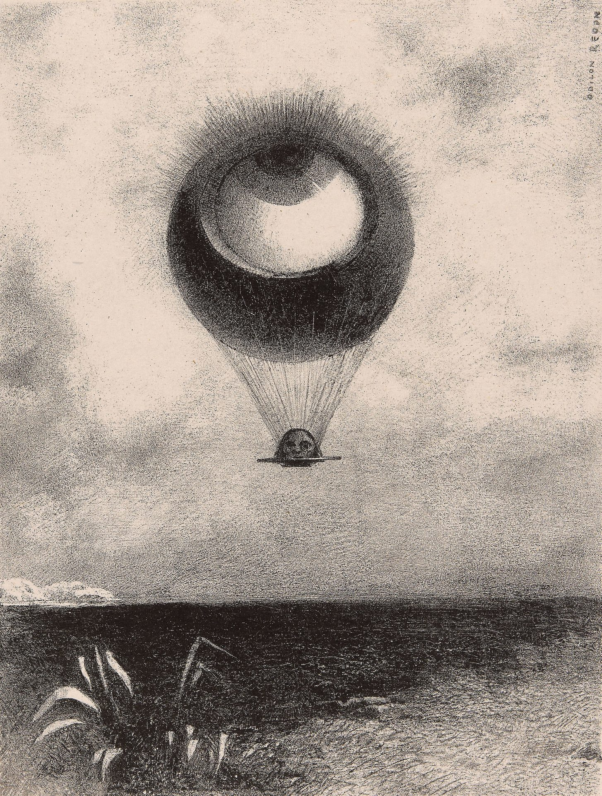

## 基本信息

- 作者：[[雷东 Odilon Redon]]
- 创作年代：1882
- 材质：石版画 / 炭笔（*not from wiki*：原系雷东献给爱伦·坡的石版画集"À Edgar Poe"中的一帧）
- 尺寸：年代不详
- 现存地：MoMA（纽约现代艺术博物馆）等多家美术馆藏有版次（*not from wiki*）

## 画面与技法

一只巨大的眼球从地面浮起、像热气球一样升向天空——雷东典型的怪诞早期黑白母题。顾衡 051 把它作为雷东 **"黑色 = 最为本质的色彩 / 寻找线条和造型的普遍规律"** 阶段的代表性作品。

## 历史背景 (*not from wiki*)

雷东的"黑色时期"作品集（noirs）中最常被引用的图像之一，常配献给爱伦·坡的题词。

## 图片清单

| 编号 | 出自 | 描述 |
|---|---|---|
| 01 | [[051｜雷东：怪诞是不是象征主义的方向？]] | 眼球气球升向天空 |

## 出现在

- [[051｜雷东：怪诞是不是象征主义的方向？]]
