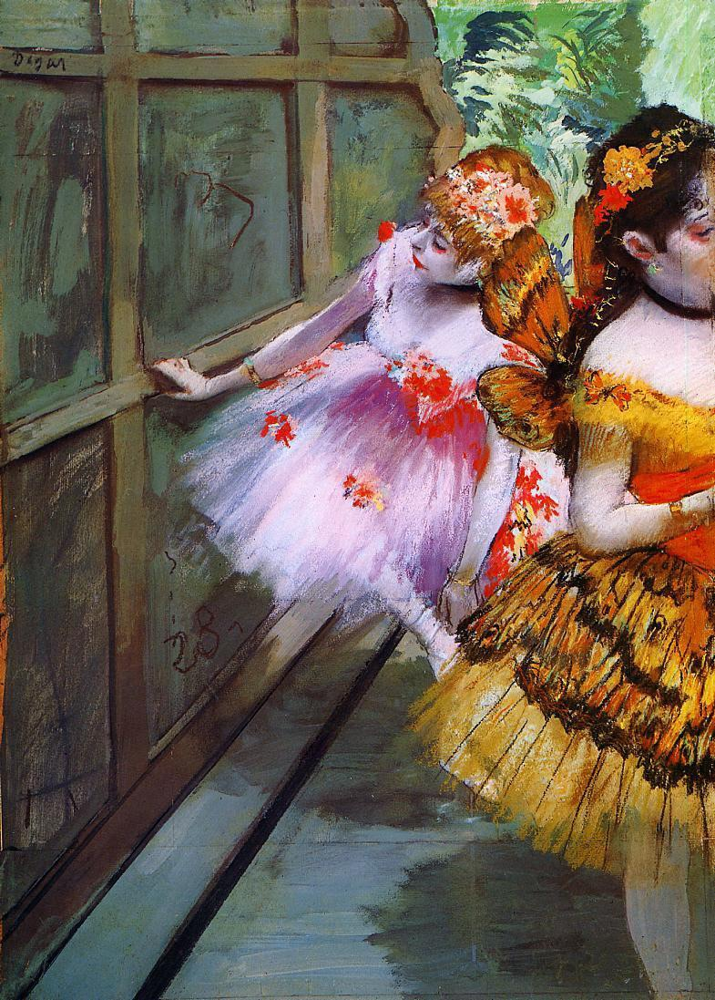

## 基本信息

- 作者：[[德加 Edgar Degas]]
- 创作年代：1880
- 材质：粉彩 (*not from wiki*)
- 尺寸：(*not from wiki*)
- 现存地：(*not from wiki*)

## 画面与技法

舞女们身着蝴蝶服装的后台准备状态——典型的 **德加后台视角**。045 顾衡：德加"对女人是又爱又怕"的解读（来自 [[凡·高 Vincent van Gogh]]）被顾衡反驳——真正的解释来自德加的朋友、象征派诗人 [[瓦雷里 Paul Valéry]]：德加一生都在"从裸女的无数个姿态中，萃取出女性身体所特有的线条系统"。

## 历史背景

(*not from wiki*) 1880 年代德加把 19 世纪芭蕾后台的等级、训练、不雅的真实状态画出来——与公众通常欣赏的"舞台上的优雅"形成强烈反差。

## 图片清单

| 编号 | 出自 | 描述 |
|---|---|---|
| 01 | [[045｜德加：为什么印象派以他结束？]] | 后台中的蝴蝶装舞女 |

## 出现在

- [[045｜德加：为什么印象派以他结束？]]
