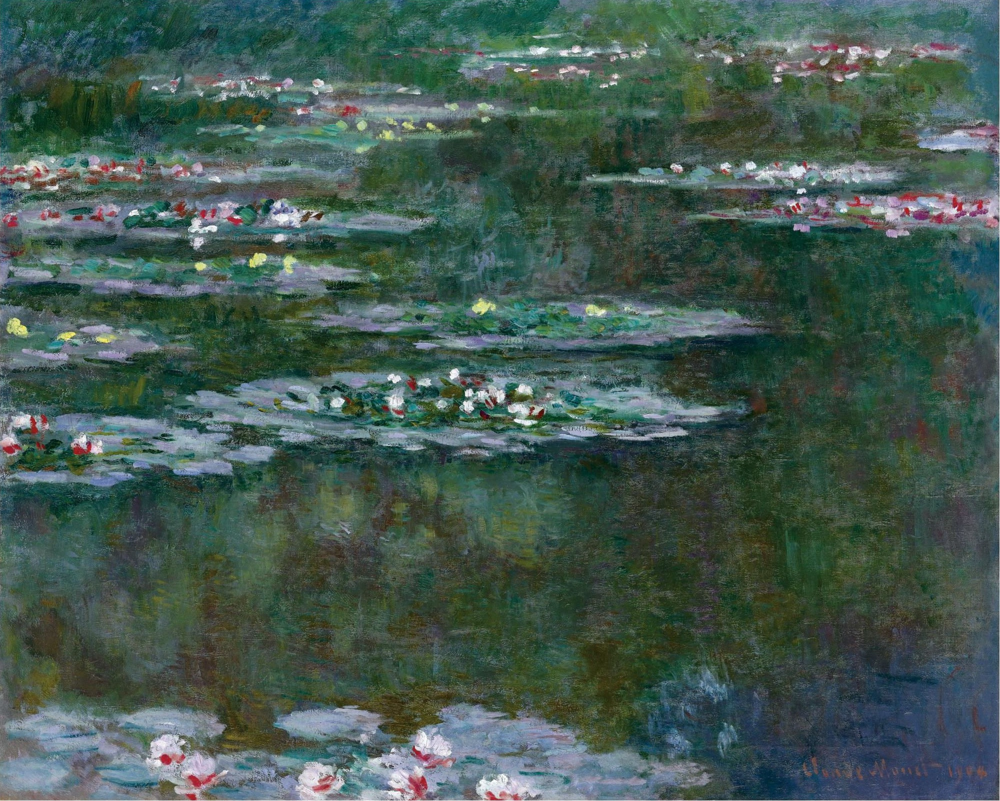
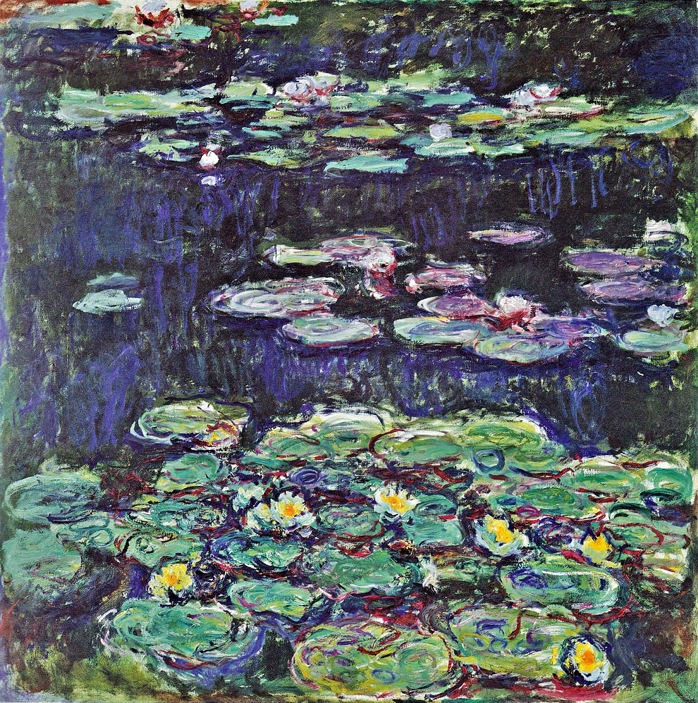
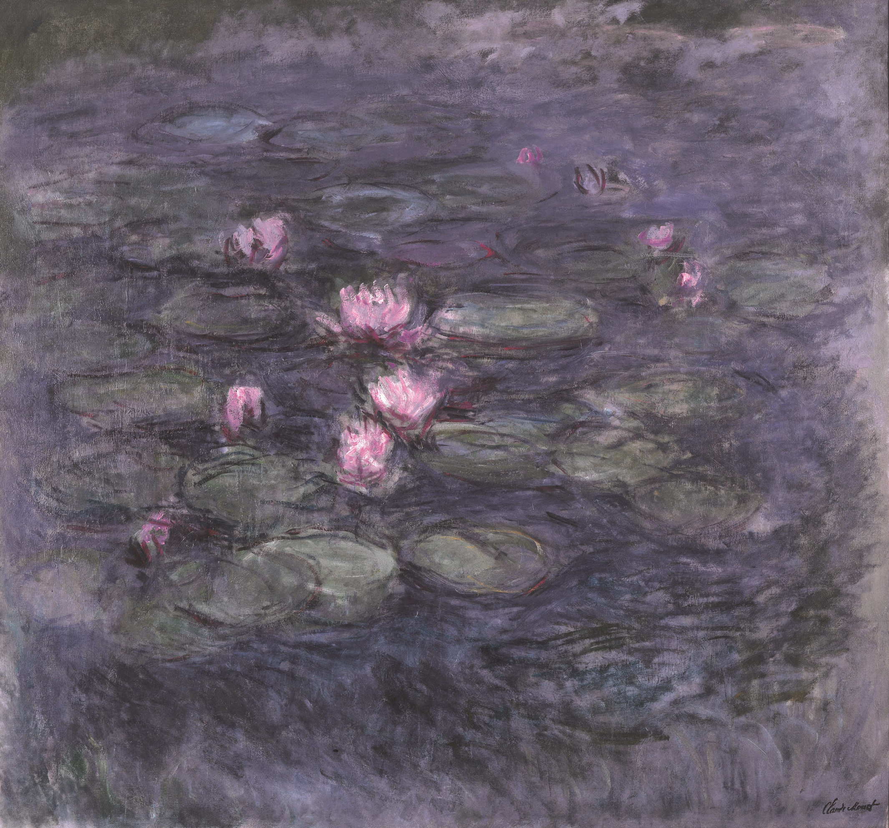

## 基本信息

- 作者：[[莫奈 Claude Monet]]
- 创作年代：1890s – 1926 （共 250 余幅，本课注 1890–1926）(*not from wiki*)
- 材质：布面油画 (*not from wiki*)
- 尺寸：从中等到 2 × 6 m 巨幅（橘园 *Orangerie* 系列）(*not from wiki*)
- 现存地：分散全球——巴黎橘园美术馆、奥赛、玛摩丹、MoMA、芝加哥、伦敦泰特等 (*not from wiki*)
- **创作地**：[[莫奈 Claude Monet]] 1883 年起定居的吉维尔尼 (Giverny) 花园 —— **按日本风修建**的莲花池

## 画面与技法

吉维尔尼日式花园中的莲花池——**水面、莲叶、倒影、天光全部融为色彩振动**。

042 顾衡定位：这是 [[组画 Series Paintings|组画]] 模式的终极作品；也是莫奈"**画家对某一个参数的极致追求，必然要牺牲其他参数为代价**"的极端样本。

### 三个阶段（顾衡 042）

1. **早中期睡莲（1890s–1910s）**——组画模式成熟，光线与色彩主导，但**形状仍可辨认**。
2. **1914 年睡莲（本页 04 图）**——"**整个画面只是流溢着光线和色彩，形状却崩溃了**"——是顾衡 042 用以批评极致追光"必然背离印象派初衷"的关键证据。
3. **1916–1923 白内障晚期睡莲**——莫奈视力极差、靠颜料管标签辨色——"**真的'凭印象画画了'**"——但"今天人们普遍认为，莫奈画的 200 多幅睡莲中，**反而是 1916–1923 年这个阶段的最好**"。**看不见反而摆脱了"光线与形状之间的困扰"**——这是 042 全篇最反讽的结论。

### 莫奈的"光的外壳"宣言

> "莫奈最后干脆就**否认了物质的实在属性，而声称我们眼睛所能看到的，都只是一个'光的外壳'**。"

—— 印象派纲领从"忠实记录眼睛所见"走到形而上学终点的标志。

## 历史背景 (*not from wiki*)

1916 莫奈在吉维尔尼建造大画室；1918 年一战停战日次日致信总理克列孟梭，承诺将巨幅睡莲（"装饰画" Grandes Décorations）捐给国家。1927 年莫奈逝世次年，**橘园美术馆** *L'Orangerie* 8 块全景睡莲壁画对外开放——被誉为"印象派的西斯廷礼拜堂"。

## 图片清单

| 编号 | 出自 | 描述 |
|---|---|---|
| 01 | [[042｜莫奈2：《日出·印象》是不是印象派作品？]] | 系列选作 1 |
| 02 | [[042｜莫奈2：《日出·印象》是不是印象派作品？]] | 系列选作 2 |
| 03 | [[042｜莫奈2：《日出·印象》是不是印象派作品？]] | 系列选作 3 |
| 04 | [[042｜莫奈2：《日出·印象》是不是印象派作品？]] | 1914 年睡莲——形状崩溃、纯光与色彩 |

## 出现在

- [[042｜莫奈2：《日出·印象》是不是印象派作品？]]
