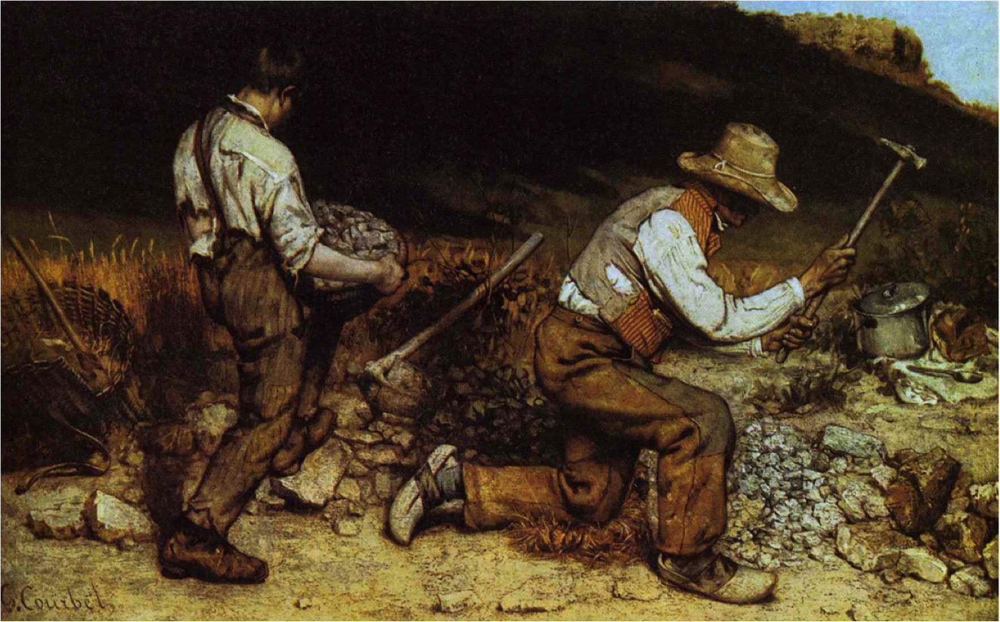

## 基本信息

- 作者：[[居斯塔夫·库尔贝 Gustave Courbet]]
- 创作年代：1850
- 材质：布面油画 (*not from wiki*)
- 尺寸：约 165 × 257 cm (*not from wiki*)
- 现存地：**原藏德累斯顿现代大师画廊，二战德累斯顿轰炸 1945 被毁，画作已不存** (*not from wiki*)

## 画面与技法

道路边两位碎石工——左侧老者跪地举锤砸石、右侧年轻男孩背送石筐。**俩人背身或半侧——库尔贝有意不让观者看到表情**，强化"无名劳动者"的匿名性。

## 历史背景

顾衡 035 明示：

> 他看到了筛麦女、**碎石工**，就把这些劳动的场景都画下来。以前学院派都画神话、画英雄，那么库尔贝选择的题材，对于学院派而言就是颠覆性的。

(*not from wiki*) 1850–1851 沙龙首展，是 [[现实主义 Realism]] 流派的**最强标志性作品**之一，也常被左翼艺术史家视为**社会主义题材绘画**的奠基。原画于 1945 年 2 月 13–14 日德累斯顿大轰炸中被毁——只剩照片和素描存世。

## 图片清单

| 编号 | 出自 | 描述 |
|---|---|---|
| 01 | [[035｜库尔贝：为什么现实主义的开创者争议那么大？]] | 老少两碎石工于路边劳动 |

## 出现在

- [[035｜库尔贝：为什么现实主义的开创者争议那么大？]]
