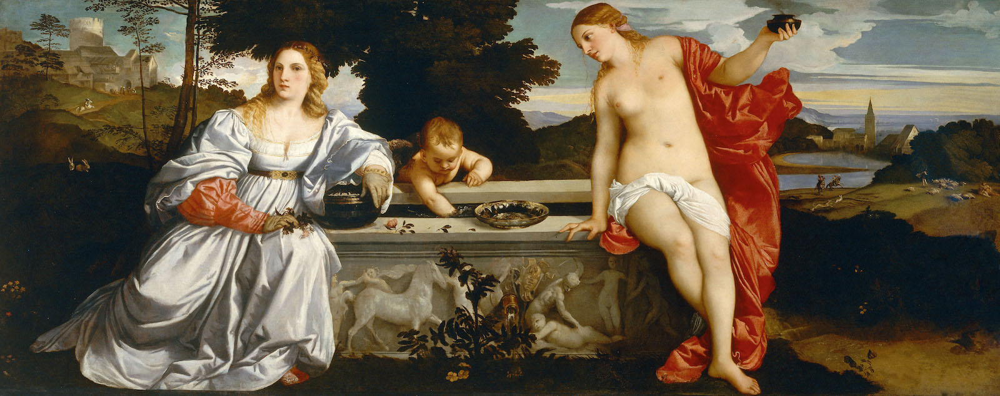

## 基本信息

- 作者：[[提香 Titian]]
- 创作年代：约 1514
- 材质：布面油画 (*not from wiki*)
- 尺寸：118 × 279 cm (*not from wiki*)
- 现存地：罗马博尔盖塞美术馆 (Galleria Borghese, Roma) (*not from wiki*)

## 画面与技法

**水平卷轴式横构图**。前景一口**石棺**——上有古罗马风格浮雕——把画面**横向切开**：

- 左：盛装贵妇（"神圣爱"或"世俗爱"，学界至今争论）
- 中：丘比特小天使**搅动石棺水池**
- 右：裸体女神（另一种"爱"）举着燃烧的灯

**顾衡 037 关于风景的核心论点**：

- 提香**在前景画了一口石棺，一挡一大片**——从石棺再往后**就是远景**
- 但**也不能都挡住**，所以**石棺左边画了个小山包、右边是一个向下的小斜坡**
- **风景就既有层次感、又能彼此连接**——既不需要像贝里尼那样俯瞰、也不需要像波拉约洛那样把人挑高
- 这是**意大利画家解决风景构图问题的最终方案**——文艺复兴风景从《纳税银》到本作**90 年内进步巨大**

**风景的进步**：与 [[基督下十字架 (拉斐尔) Deposition (Raphael)]] 比较（仅相差 7 年）——本作远景**有真实景深与色彩过渡**，拉斐尔的远景仍是"鬼画符"。

## 历史背景

(*not from wiki*) 1514 年由威尼斯长官 Niccolò Aurelio 委托——结婚画，给新娘 Laura Bagarotto。两位"爱"可能分别象征**新娘的世俗身份与神圣象征**——但具体寓意学界至今未达成共识。后来 1608 年由博尔盖塞红衣主教购入，至今藏于罗马博尔盖塞美术馆。

## 图片清单

| 编号 | 出自 | 描述 |
|---|---|---|
| 01 | [[037｜为什么说古典时代没有风景画？]] | 整体图（前景石棺 + 两侧风景） |

## 出现在

- [[037｜为什么说古典时代没有风景画？]]
