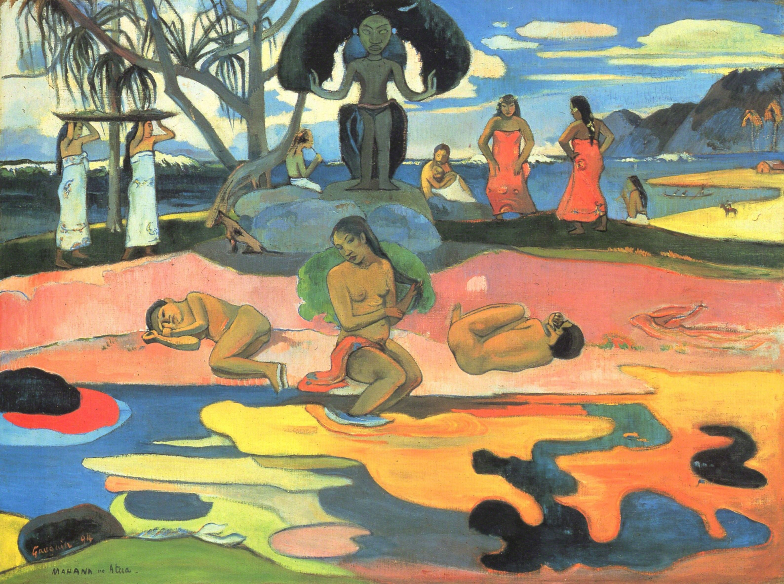

## 基本信息

- 作者: [[高更 Paul Gauguin]]
- 创作年代: 1894
- 材质: 布面油画 (*not from wiki*)
- 尺寸: 68.3 × 91.5 cm (*not from wiki*)
- 现存地: 芝加哥艺术学院 (Art Institute of Chicago) (*not from wiki*)

## 画面与技法

- 塔希提时期中段代表作。
- 用塔希提语 *Mahana no atua* 命名，括号注法语 "Day of the God"——高更"为了增加神秘感"的命名策略典例。
- [[综合主义 Synthetism]] 全部四条特征齐备：形体简化、封闭轮廓平涂、颜色主观、色块对比构纵深；装饰性突出。

## 历史背景 (*not from wiki*)

1893 年高更短暂回巴黎办画展并出版 *Noa Noa*；1894 年这幅画即在回巴黎期间或回塔希提前后创作。

## 图片清单

| 编号 | 出自 | 描述 |
|---|---|---|
| 01 | [[056｜高更2：象征主义还能走多远？]] | 全图 — 塔希提神像与浴女 |

## 出现在

- [[056｜高更2：象征主义还能走多远？]]
