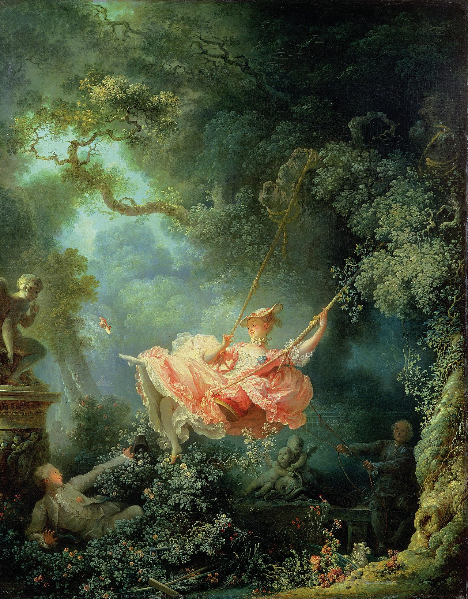

## 基本信息

- 作者：[[弗拉戈纳尔 Jean-Honoré Fragonard]]
- 创作年代：1767
- 材质：布面油画 (*not from wiki*)
- 尺寸：81 × 64 cm (*not from wiki*)
- 现存地：伦敦华莱士收藏 Wallace Collection, London (*not from wiki*)

## 画面与技法

绿荫繁茂的花园中，一位粉红色长裙的少妇荡着秋千——绸缎裙摆在半空中翻飞、踢出的**一只小鞋飞向画面左上**。画面右下角阴影里：一位**上了岁数的主教**正在拉绳推秋千；画面左下角：**年轻男子**藏在玫瑰丛后仰面观望，恰好被翻起的裙摆给到"窥视"的角度，伸手作要"捡鞋"状。秋千上方挂着小天使 / 丘比特雕像——少妇踢飞的鞋正向它而去。

## 顾衡解读（029）

**洛可可绘画的代表作**：

> 这幅画的构思来自于一位叫圣·朱利安的男爵，就是画面左下角的这位男子。画面右方，是一个上了岁数的主教在推秋千，秋千上的少妇一边娇笑，一边把一只鞋踢向那尊丘比特小雕像。年轻男人以捡鞋为由，抬起头向上观看。
> 
> **发乎情，止乎非礼，半推半就点到为止，这个才是洛可可的精髓所在**。而色情，恰恰是洛可可时期的贵族们极力要避免的东西，因为那不仅庸俗，而且无聊。

整幅画把洛可可的全部精神浓缩在一个**三角调情结构**里：被欺瞒的"老主教"在阴影中卖力推秋千；明面光照下的少妇带着挑逗的笑意；前景藏匿的**情人 / 订主**在玫瑰丛里享受这一切。

## 历史背景

(*not from wiki*) 据 18 世纪记载（小说家 Charles Collé 的日记），原本订主 **圣·朱利安男爵 (Baron de Saint-Julien)** 先找到画家 Gabriel-François Doyen，要求让"主教推秋千、自己藏在能看见情妇腿的位置"。Doyen 拒绝了这个题材，把订单转给了弗拉戈纳尔。最终版本把主教改得更老、更滑稽，使整幅画落定于"调情而非色情"的洛可可调子。

## 图片清单

| 编号 | 出自 | 描述 |
|---|---|---|
| 01 | [[029｜洛可可为什么那么香艳？]] | 整体图 |

## 出现在

- [[029｜洛可可为什么那么香艳？]]
