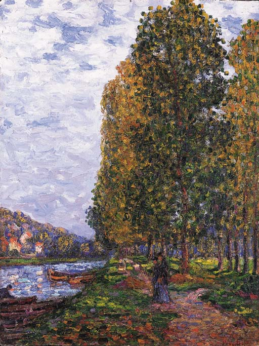

## 基本信息

- 作者：[[毕卡比亚 Francis Picabia]]
- 创作年代：1905
- 材质：布面油画 (*not from wiki*)
- 尺寸：年代不详 (*not from wiki*)
- 现存地：私人收藏 (*not from wiki*)

## 画面与技法

[[毕卡比亚 Francis Picabia]] 印象派出道期作品——洛因河 (le Loing) 是塞纳河支流，圣马姆斯是河口小镇 (*not from wiki*：与莫雷、巴尔比松同区)。秋色调，[[印象派 Impressionism]] 笔触。

## 历史背景

(*not from wiki*) 1904–1905 系列印象派写生的一员，"忠实致敬莫奈、刻意模仿毕沙罗"。

## 图片清单

| 编号 | 出自 | 描述 |
|---|---|---|
| 01 | [[091｜毕卡比亚：如何用绘画表现达达主义？]] | 整体图 — 秋日洛因河岸 |

## 出现在

- [[091｜毕卡比亚：如何用绘画表现达达主义？]]
