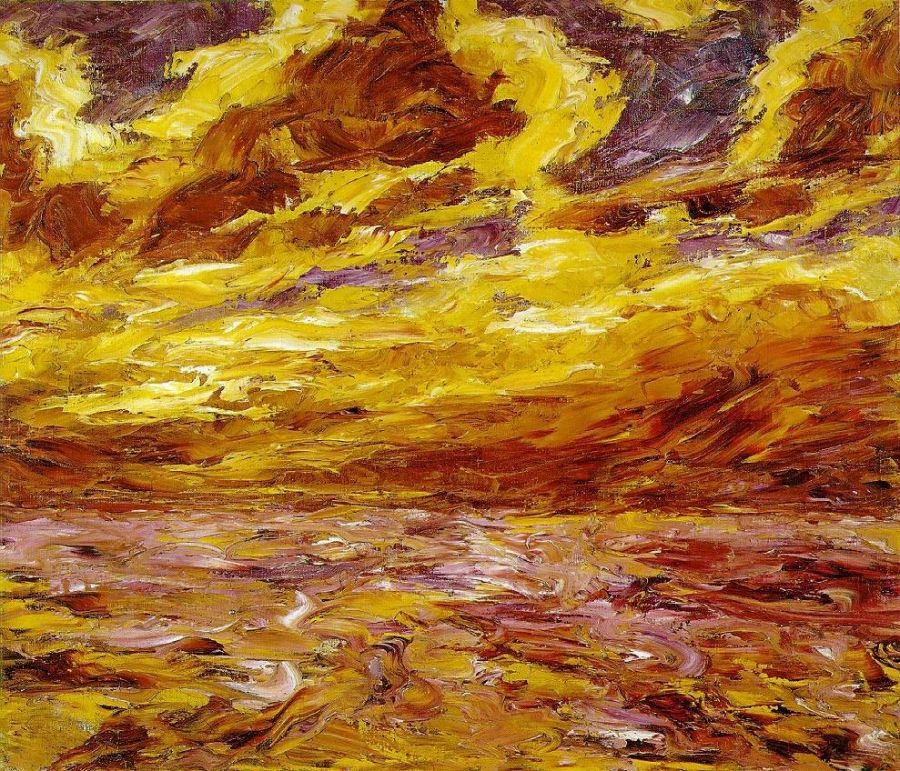

## 基本信息

- **作者**：[[诺尔德 Emil Nolde]]
- **创作年代**：1910
- **材质**：布面油画 (*not from wiki*)
- **尺寸**：暂不详 (*not from wiki*)
- **现存地**：暂不详 (*not from wiki*)

## 画面与技法

- 072 与 [[基督上十字架 (诺尔德) The Life of Christ]]、[[面具 (诺尔德) Mask Still Life III]] 同组出现，作为**诺尔德"综合期"**——综合 [[高更 Paul Gauguin]] / [[凡·高 Vincent van Gogh]] / [[马蒂斯 Henri Matisse]] / [[毕加索 Pablo Picasso]] 四家——的代表作。
- "凡·高 + 马蒂斯"或"凡·高式笔触 + 马蒂斯主观色彩"的混搭感。

## 历史背景 (*not from wiki*)

1910 北德海岸题材；诺尔德对北海 / 波罗的海强烈天空的兴趣此期形成。

## 图片清单

| 编号 | 出自 | 描述 |
|---|---|---|
| 01 | [[072｜桥社：什么是表现主义绘画的使命？]] | Autumn Sea 1910 — 综合期 |

## 出现在

- [[072｜桥社：什么是表现主义绘画的使命？]]
