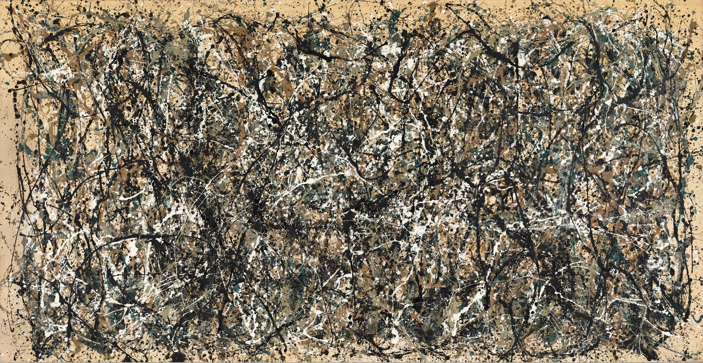

## 基本信息

- 作者：[[波洛克 Jackson Pollock]]
- 创作年代：1950
- 材质：搪瓷漆于画布 (*not from wiki*)
- 尺寸：约 2.66 m × 5.25 m (*not from wiki*)
- 现存地：纽约大都会艺术博物馆 Metropolitan Museum of Art (*not from wiki*)

## 画面与技法

[[滴画法 Drip Painting]] 巅峰之作，[[抽象表现主义 Abstract Expressionism]] 的标志作品。**关键性事件**：1950 年《生活》杂志派摄影师拍下波洛克在玻璃上创作这幅画的过程，在电视上播放——"波洛克这个画法，就像萨满巫师跳大神，特别有镜头感"。这次电视播出**直接把波洛克塑造成孤独面对画布的英雄**，让他一夜爆红。

但也正是这次电视拍摄之后，波洛克陷入精神危机——在 [[克拉斯纳 Lee Krasner]] 摆的庆功宴上当众掀桌，流着泪大骂媒体是骗子。

## 历史背景 (*not from wiki*)

1950 年是抽象表现主义国际化与冷战美国"文化软实力"建设的关键年份。《生活》杂志的纪录片是美国国家文化战略与艺术媒体合谋的典型样本。

## 图片清单

| 编号 | 出自 | 描述 |
|---|---|---|
| 01 | [[096｜波洛克：什么是当代艺术的第一个流派？]] | 秋韵 Autumn Rhythm (1950) |

## 出现在

- [[096｜波洛克：什么是当代艺术的第一个流派？]]
