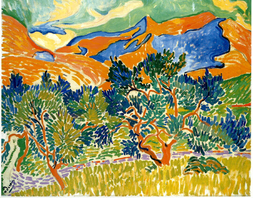

## 基本信息

- 作者：[[德朗 André Derain]]
- 创作年代：1905
- 材质：油彩，画布 (*not from wiki*)
- 现存地：华盛顿国家美术馆 (National Gallery of Art) (*not from wiki*)

## 画面与技法

[[德朗 André Derain]] 1905 年夏在法国南部 Collioure 写生的作品之一，与 [[科里乌尔港 Le Port de Pêche de Collioure]] 同一时期同一地点。**这一时期是德朗用色最鲜艳的时期** (顾衡 063)。德朗自己评价这批作品：

> 色彩成了炸弹。它们必然会放射光芒。在其新鲜感中，任何东西都可能上升到真实之上。

——这就是 [[野兽派 Fauvism]] 的"南法纯色美学"的核心宣言。

## 历史背景 (*not from wiki*)

- 1905 年夏 [[德朗 André Derain]] 与 [[马蒂斯 Henri Matisse]] 共同在 Collioure 度夏写生——通过 [[高更 Paul Gauguin]] 生前好友蒙弗雷德看到大量高更作品，是 [[野兽派 Fauvism]] 诞生的孕育地。
- 1905 秋季沙龙第七展室即由 Collioure 之夏的作品撑起。

## 图片清单

| 编号 | 出自 | 描述 |
|---|---|---|
| 01 | [[063｜野兽派，除了马蒂斯还能谈什么？]] | 整幅画面——1905 Collioure 之夏 |

## 出现在

- [[063｜野兽派，除了马蒂斯还能谈什么？]] —— "色彩成了炸弹" 宣言的样本
